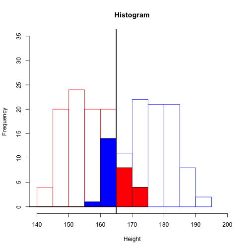
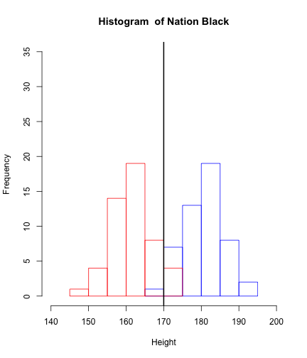
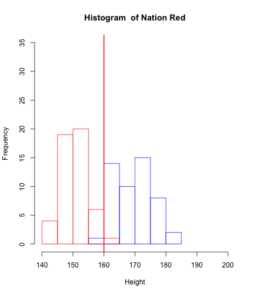
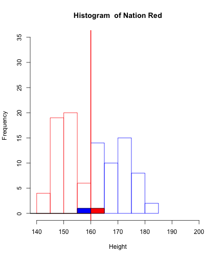
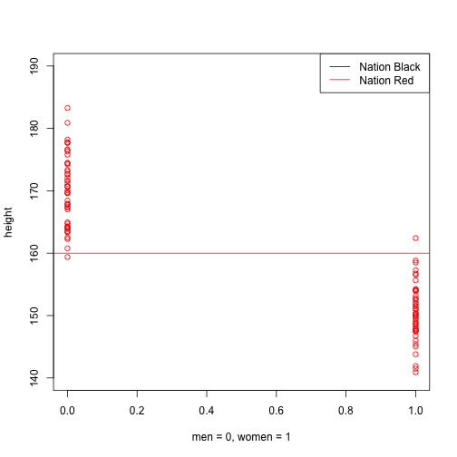
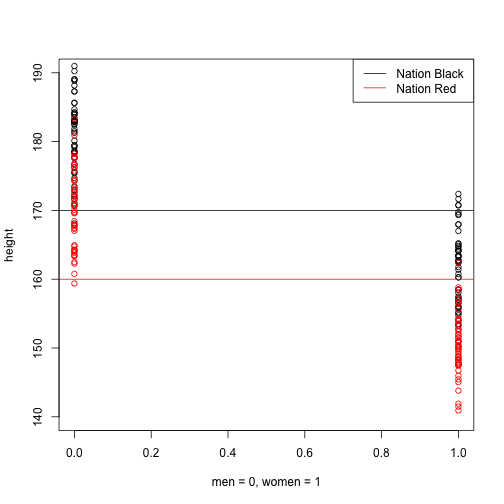
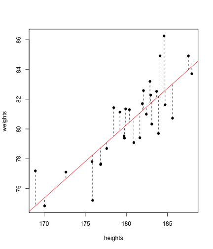

## Contents

1. Why Model?
2. How Model?
3. Which Model?

--- .class #id

## Why?

---

## Why?

### 설명 : 선형 모형(Linear Model) 선호  
키가 170이상이면 남자   
키가 1cm 증가할 때마다 몸무게가 1kg 증가  
월 소득이 100만원 증가할 때마다 몸무게가 1kg 감소  
월 소득이 1000만원이상이면 몸무게 증가없음(선형 VS 비선형)    

### 예측 : 비선형 모형(Non-Linear Model) 선호  
몸무게는 (log(키) + log(나이 - 50))*(소득수준의 제곱)  
키와 나이의 Gaussian Kernel에서 .3이 높아지면 몸무게는 1kg이 증가한다  
[Kernel](http://www.eric-kim.net/eric-kim-net/posts/1/kernel_trick.html)  

### 설명 + 예측 : 풀어야 할 숙제


---

## 키와 성별

 

---

## 키와 성별

 

---

## 키와 성별

 

--- &twocol

## 키와 성별, 국가

*** =left

 

*** =right

 

--- &twocol

## 키와 성별, 국가

*** =left

 

*** =right

 

--- &twocol

## 키와 성별, 국가


*** =left

 

*** =right

 

---

## 키와 성별

 

---

## 키와 성별, 국가

 

---

## 키와 성별, 국가

 

---

## 키와 성별, 국가

 

---

## 키와 성별, 국가

 

---

## 공분산(Covariance)과 상관관계(Correlation) 
- 두 변수의 변화 사이의 관계, 한 변수가 변화함에 따라 다른 변수가 변화하는 경향성  
- 일반적으로 선형관계를 나타냄  


```
## [1] 0.8194
```

---

## 더 생각해 볼 문제들

### 상호작용  

Black Nation에서는 키가 남 > 여  
  
Red Nation에서는 키가 여 > 남  
  
-> 성별과 국가 상호작용 추가  

### 선형관계  

-> 문제는 항상 선형관계를 만족하는가?

-> 나이와 키는 비선형관계  

### Curse of Dimensionality

-> 많은 변수로 예측하는 것이 항상 좋은 것인가?

--- &twocol

## Model Complexity

*** =left

 

*** =right

<!-- html table generated in R 3.1.3 by xtable 1.7-4 package -->
<!-- Wed Jun 10 01:33:10 2015 -->
<table border=1>
<tr> <th>  </th> <th> Estimate </th> <th> Std. Error </th> <th> t value </th> <th> Pr(&gt;|t|) </th>  </tr>
  <tr> <td align="right"> (Intercept) </td> <td align="right"> -8.29 </td> <td align="right"> 11.74 </td> <td align="right"> -0.71 </td> <td align="right"> 0.49 </td> </tr>
  <tr> <td align="right"> heights </td> <td align="right"> 0.49 </td> <td align="right"> 0.07 </td> <td align="right"> 7.56 </td> <td align="right"> 0.00 </td> </tr>
   </table>

---

 

---

## Over-Fitting(과적합)

 

---

## How? Model Evaluation

---

## How? Model Evaluation

### Cross-Validtion
- Training Set, Validation Set, Test Set
- K-fold

### How to avoid Over-fitting
- Penality of Model Complexity (MSE 보정)
- Regulization (Lasso, Ridge, Elastic Net)
- Bayesian
- Drop Out, Bagging, Feature Bagging

---

## Which Model?

### Supervised Learning
- Y를 알 때 
- P(Y|X) : Discriminative Model

### Unsupervised Learning
- Y를 모를 때  
- P(X)  
- P(Y,X) : Generative Model   
[참고](http://www.quora.com/Is-it-possible-for-unsupervised-learning-algorithms-to-outperform-supervised-ones)  

### Semi-Supervised Learning  
### Reinforce Learning

---

## Random Forest


[Random Forest](http://www.math.usu.edu/adele/randomforests/ovronnaz.pdf)  
  

[How to work](http://pubs.rsc.org/en/content/articlehtml/2009/mb/b907946g)  
  
  
[How to avoid over-fiting](http://www.quora.com/How-bagging-can-avoid-over-fitting-in-Random-Forest-classification)  
  
  
[Titanic example](http://trevorstephens.com/post/73770963794/titanic-getting-started-with-r-part-5-random)  
