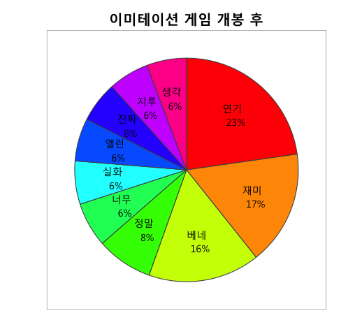
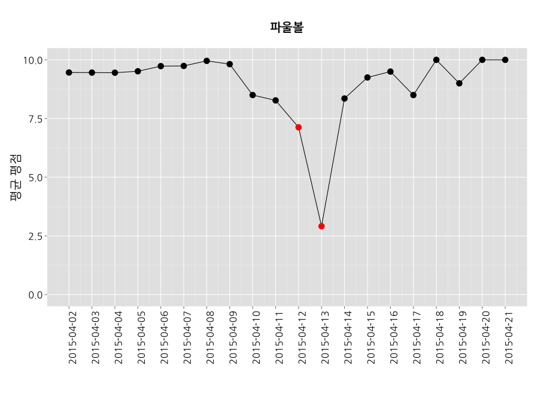
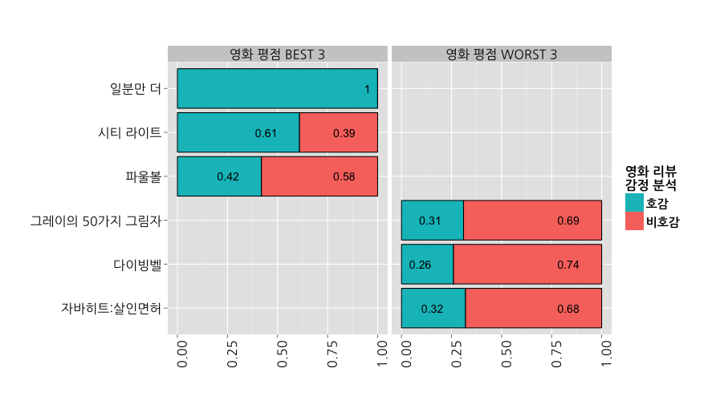
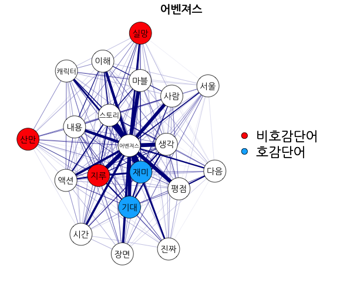
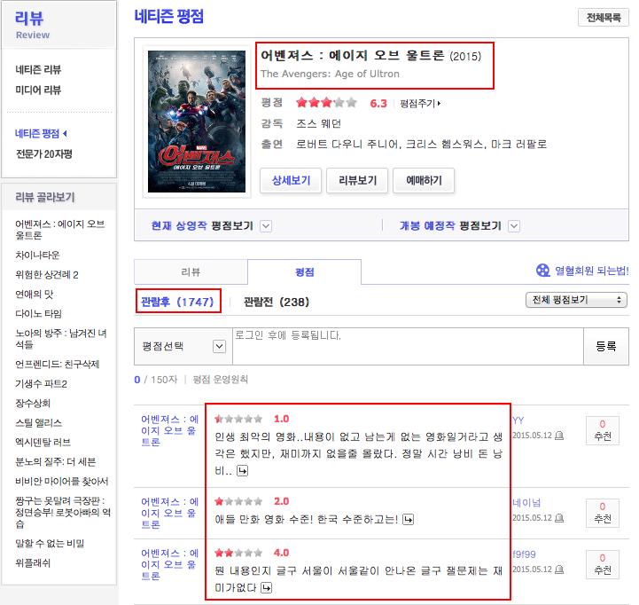
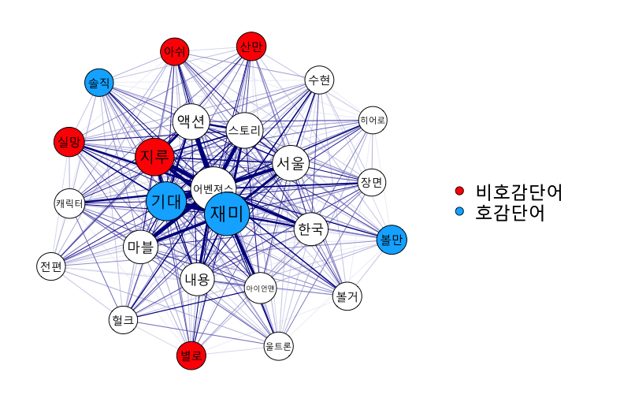

## 영화 자료를 이용한 다양한 분석

<h3>Topics</h3>
* 주제(topic) 분류 - Text & Self-Rating   
* 개인별 영화 추천 - Text & Self-Rating   
* <font color="red">감정 분석 - Text </font> & Self-Rating

<h3> Method </h3>
* <font color="red"> Visualization</font>  
* Prediction  

<h3> Model </h3>
* Lasso LM / LSA / LDA / Deep Learning  

--- &twocol w1:50% w2:50% .new-background

## 분석 예시 - Text

*** =left
<center></center>

*** =right
<center></center>

--- .new-background

## 분석 예시 - Self-Rating

<center></center>

--- .new-background

## 분석 예시 - Self-Rating & Text

<center></center>

--- .new-background

## 목차

<h4><br></h4>
<h3 style="text-align:left">1. R 기초 세팅</h3>
<h3 style="text-align:left">2. 패키지 인스톨</h3>    
<h3 style="text-align:left">3. 어벤져스 웹크롤</h3>  
<h3 style="text-align:left">4. 감정사전 불러오기</h3>  
<h3 style="text-align:left">5. 키워드 파싱 및 추출</h3>
<h3 style="text-align:left">6. Co-occurrence Matrix</h3>  
<h3 style="text-align:left">7. 시각화</h3>  

--- &twocol w1:40% w2:60% .new-background

## 목차

*** =left
<h4><br></h4>
<h3 style="text-align:left">1. R 기초 세팅</h3>
<h3 style="text-align:left">2. 패키지 인스톨</h3>    
<h3 style="text-align:left">3. 어벤져스 웹크롤</h3>  
<h3 style="text-align:left">4. 감정사전 불러오기</h3>  
<h3 style="text-align:left">5. 키워드 파싱 및 추출</h3>  
<h3 style="text-align:left">6. Co-occurrence Matrix</h3>  
<h3 style="text-align:left">7. 시각화</h3>  

*** =right
<center></center>
---

--- .dark .segue .nobackground

## 1. R 기초 세팅

--- .new-background

## 1. R 기초 세팅

<h3b><font color="blue"><b> 학습 목표 </b></font></h3b>  
<h3b> - R에서 작업 디렉토리 설정하기</h3b>  
<h3b> - MAC의 경우 그래픽 설정하기</h3b>

--- .new-background

## 1. R 기초 세팅

- MAC

```{r, eval=T}
##  사용자 경로
user_path = "/Users/kimhyungjun/repo/daum_movie/" 
par(family="AppleGothic")  ##  그림 출력시 한글폰트
```

- Windows

```{r, eval=F}
user_path = "C:/Users/kimhyungjun/repo/daum_movie/"  
```

- MAC & Windows 공통

```{r, eval=T}
setwd(user_path)
```

```

--- .dark .segue .nobackground
## 2. 패키지 인스톨

--- .new-background

## 2. 패키지 인스톨

<h3b><font color="blue"><b> 학습 목표 </b></font></h3b>  
<h3b> - 패키지 인스톨</h3b>  
<h3b> - 패키지 불러오기</h3b>

--- .new-background .modal

## 2. 패키지 인스톨

<h4></br></h4>
<h4></br></h4>

<h4>영화 웹크롤 및 파싱</h4>
* [rvest](http://cran.r-project.org/web/packages/rvest/index.html)  
* [stringr](http://cran.r-project.org/web/packages/stringr/index.html)  

<h4></br></h4>
<h4></br></h4>

<h4>감정 사전 (엑셀파일 읽기)</h4>
* [readxl](http://cran.r-project.org/web/packages/readxl/index.html)  
* [한국어 감정 사전 1](http://word.snu.ac.kr/kosac/)  
* [한국어 감정 사전 2](http://clab.snu.ac.kr/arssa/doku.php?id=app_dict_1.0)  
* [참고 논문 모음 1](http://word.snu.ac.kr/kosac/publications.php)  
* [참고 논문 모음 2](http://clab.snu.ac.kr/arssa/doku.php?id=my_works)  

--- .new-background

## 2. 패키지 인스톨

<h4></br></h4>
<h4></br></h4>

<h4>텍스트 분석</h4>
* [dplyr](http://cran.r-project.org/web/packages/dplyr/index.html)  
* [tm](http://cran.r-project.org/web/packages/tm/index.html)  

<h4></br></h4>
<h4></br></h4>

<h4>네트워크 그래프</h4>
* [qgraph](http://cran.r-project.org/web/packages/qgraph/index.html)  

--- .new-background

## 2. 패키지 인스톨

```{r, eval=F}
install.packages(c("rvest","stringr","dplyr","tm","qgraph"),
                 repos="http://cran.nexr.com")
```

<h4><br></h4>
<h9>패키지 불러오기</h9>

```{r, eval=T, message=FALSE}
library("httr")
library("rvest")
library("stringr")
library("dplyr")
library("tm")
library("qgraph")
```

--- .dark .segue .nobackground

## 3. 어벤져스 웹크롤

--- .new-background

## 3. 어벤져스 웹크롤

<h3b><font color="blue"><b> 학습 목표 </b></font></h3b>  
<h3b> - 웹사이트 배경지식</h3b>  
<h3b> - Regualr Expression(REGEX)</h3b>  
<h3b> - 단일 페이지 웹크롤</h3b>  
<h3b> - 복수 페이지 웹크롤</h3b>  

--- .new-background

## 3. 웹사이트 배경지식

- 웹브라우저 열기(e.g. Firefox, Chorme, Safari, Internet Explorer)
- 웹사이트 입력(e.g. http://movie.daum.net)

<h4><br></h4>
- 사용자는 client로 페이지, 이미지, 텍스트를 웹 서버로 요청함
- 웹 서버 사용자에게 반응을 보냄
- 사용자와 웹 서버는 프로토콜(e.g. HTTP)로 커뮤니케이션

--- .new-background .modal

## HTTP

<h4> HTTP? </h4>
- HyperText Transfer Protocal

```{r, eval=T}
library("httr")
GET("http://google.com/")  ##  Requset -> Resposne
```

--- .new-background

## 다음 영화

http://movie.daum.net

<left></left>

--- .new-background .modal

## 어벤져스 (1 페이지 웹크롤)

```{r, echo=T, eval=T, results='asis'}
urls_view <- "http://movie.daum.net/moviedetail/moviedetailNetizenPoint.do?movieId=73750&t__nil_NetizenPoint=tabName"
r <- GET(urls_view)
htxt <- html(r)
```

--- .new-background .modal

```{r, echo=F}
urls_view <- "http://movie.daum.net/moviedetail/moviedetailNetizenPoint.do?movieId=73750&t__nil_NetizenPoint=tabName"
r <- GET(urls_view)
htxt <- html(r)
```

```{r, results='asis'}
html_nodes(htxt, ".comment")
```

--- .new-background

```{r, results='asis'}
html_nodes(html_nodes(htxt, ".comment"),"a")
```

--- .new-background 

```{r, results='asis'}
html_text(html_nodes(html_nodes(htxt, ".comment"),"a"))
```

--- .new-background .modal

## REGEX (연습 1)

```{r, include=T}
ex <- c("아!! R이 왜 이렇게 재미있냐?", "[1]", "[2]", "[20]", "졸리다...") 
str_replace_all(ex, '!', '')
str_replace_all(ex, "!|\\.", "")
str_replace_all(ex, "[[:punct:]]", "")
```

--- .new-background .modal

## REGEX (연습 1)

```{r, cache=F}
str_replace_all(ex, "1", "")
str_replace_all(ex, "[1]", "")
str_replace_all(ex, "\\[1\\]", "")
```

--- .new-background

## REGEX (연습 1)

```{r, cache=F}
str_replace_all(ex, "\\[[0-9]\\]", "")
str_replace_all(ex, "\\[[0-9]+\\]", "")
```

--- .new-background .modal

## REGEX (연습 1)

```{r}

ex <- str_replace_all(ex, "\\[[0-9]+\\]", "")
```

```{r}
ex==""
ex!=""
ex[ex!=""]
```

--- .new-background

## 어벤져스 (1 페이지 웹크롤)

```{r, echo=F}
urls_view <- "http://movie.daum.net/moviedetail/moviedetailNetizenPoint.do?movieId=73750&t__nil_NetizenPoint=tabName"
r <- GET(urls_view)
htxt <- html(r)
```

```{r}
movie_text <- html_text(html_nodes(html_nodes(htxt, ".comment"),"a"))

movie_text <- str_replace_all(movie_text, "\\[[0-9]+\\]", "")  ##  영화평의 댓글 제거

movie_text <- movie_text[movie_text!=""]  ##  영화평의 댓글 제거

```

--- .new-background .modal

## FOR문 연습 & IF, break 연습

```{r, eval=T}
for (i in 1:5)
{
    print(i)
}
```

```{r, eval=T}
for (i in 1:100)
{
    if(i==3) break
    print(i)
}
```

--- .new-background .modal

## 어벤져스 전체 페이지 웹크롤

```{r, eval=F}

movie_text_sum <- c();

for (page_num in 1:1000)
{
urls_view <- paste("http://movie.daum.net/review/netizen_point/movieNetizenPoint.do?type=after&op=movieId&searchValue=73750&page=",page_num,sep="")
r <- GET(urls_view)
htxt <- html(r)

movie_text <-  html_nodes(htxt, ".comment")
movie_text <-  html_nodes(movie_text, "a")
movie_text <-  html_text(movie_text)
#movie_text <-  html_text(html_nodes(html_nodes(htxt, ".comment"),"a"))

if(length(movie_text)==0) break;

movie_text <- str_replace_all(movie_text, "\\[[0-9]+\\]", "")  ##  영화평의 댓글 제거
movie_text <- movie_text[movie_text!=""]
movie_text_sum <- c(movie_text_sum, movie_text)
print(paste(page_num, "-th page", sep=""))    
}

movie_text_sum <- str_replace_all(movie_text_sum, "\n|\n\r", " ")

```
--- .dark .segue .nobackground

## 4. 감정사전 불러오기

--- .new-background

## 4. 감정사전 불러오기

<h3b><font color="blue"><b> 학습 목표 </b></font></h3b>  
<h3b> - 파일 불러오기(read.csv)</h3b>  
<h3b> - 긍정 사전과 부정 사전으로 분할(subset)</h3b>

--- .new-background

## 4. 감정사전 불러오기

```{r, eval=T, echo=F}
emotion_dict <- read.csv(paste(user_path,"emotion_dict.csv",sep=""), 
                         header = T, 
                         fileEncoding = "UTF-8",
                         stringsAsFactors = F)
```

```{r, eval=F}
emotion_dict <- read.csv("emotion_dict.csv", 
                         header = T, 
                         fileEncoding = fileEncoding,
                         stringsAsFactors = F)
```

```{r, eval=T, include=T}
pos_word <- subset(emotion_dict, pos_neg=="pos")[,"words"]
neg_word <- subset(emotion_dict, pos_neg=="neg")[,"words"]
#emotion_dict[11:15,]; emotion_dict[1301:1305,];
```

<h4><br></h4>
[감정사전](https://www.dropbox.com/s/okv4mjiq0wlhgbl/emotion_dict.csv?dl=0)

--- .dark .segue .nobackground

## 5. 키워드 파싱 및 추출

--- .new-background

## 5. 키워드 파싱 및 추출

<h3b><font color="blue"><b> 학습 목표 </b></font></h3b>  
<h3b> - R에서 자연어 처리 문제</h3b>  
<h3b> - 키워드 추출</h3b>
- 문장 자르기
- 앞글자 추출
- 맞춤법 교정
- 한 문장으로 합치기

--- .new-background .modal

## R에서 자연어 처리 문제

<font color="red">기대</font>했던 것보다 좀 <font color="red">지루</font>했음... 와이프는 
<font color="red">재미있다</font>고...

```{r, eval=T, message=F}
library("KoNLP")
extractNoun("기대했던 것보다 좀 지루했음... 와이프는 재미있다고...")
```

```{r, eval=T}
str_split("기대했던 것보다 좀 지루했음... 와이프는 재미있다고...", " ")[[1]]
str_sub(str_split("기대했던 것보다 좀 지루했음... 와이프는 재미있다고...", " ")[[1]],1,2)
```

--- .new-background .modal

## 키워드 추출 (집중!!)

* Step 1) 문장 자르기(split)

```{r, eval=T}
ex <- "기대보다 아주 재밌음!!!!!!!! !! 꼭 봐요~ > < *"
```

```{r, eval=T}
result <- str_split(ex, "([ㄱ-ㅎㅏ-ㅢ]|[[:punct:]]|[0-9A-Za-z]|[[:space:]])+" ) 
result
```

--- .new-background

## 키워드 추출 (집중!!)

* Step 2) 앞 2글자 추출

```{r, eval=T}
result <- str_sub(result[[1]], 1, 2)
result
```

--- .new-background

## 키워드 추출 (집중!!)

* Step 3) 맞춤법 교정
```{r, eval=T}
plyr::revalue("재밌", c("재밌" =  "재미", "재믿" = "재미"), warn_missing=F)
plyr::revalue(result, c("재밌" =  "재미", "재믿" = "재미"), warn_missing=F)
```

--- .new-background

## 키워드 추출 (집중!!)

* Step 4) 다시 한 문장으로 합치기
```{r, eval=T}
paste(c("하", "R은", "정말", "신나"), sep= ' ')
paste(c("하", "R은", "정말", "신나"),collapse=" ")
paste(c("하", "R은", "정말", "신나"),collapse="+")
```

--- .new-background

## 키워드 추출 (어벤져스)

* Step 1) 문장 자르기(split)

```{r, echo=F, include=T}
movie_text_sum <- read.csv(paste(user_path,"avengers_text.csv",sep=""), 
                           header = T, 
                           fileEncoding = "UTF-8",
                           stringsAsFactors = F)
movie_text_sum <- movie_text_sum[[1]]
```

```{r, eval=T, include=T}
key_vec <- str_split(movie_text_sum[1], 
          "([ㄱ-ㅎㅏ-ㅢ]|[[:punct:]]|[0-9A-Za-z]|[[:space:]])+" )
key_vec
```

--- .new-background

## 키워드 추출 (어벤져스)

* Step 2) 앞 2글자 추출

```{r, eval=T, include=T}
key_vec <- str_sub(key_vec[[1]], 1, 2)
key_vec
```

--- .new-background .modal

## 키워드 추출 (어벤져스)

* Step 3) 맞춤법 교정

```{r, eval=T, include=T}
movie_name <- "어벤져스"
key_vec <- plyr::revalue(key_vec, c("재밌" = "재미",
                                    "재밋" = "재미",
                                    "잼있" = "재미",
                                    "영화" = movie_name,
                                    "스토" = "스토리",
                                    "시사" = "시사회",
                                    "어벤" = "어벤져스",
                                    "아이" = "아이언맨",
                                    "히어" = "히어로",
                                    "어밴져스" = "어벤져스",
                                    "캐릭" = "캐릭터",
                                    "울트" = "울트론"),
                         warn_missing = F)
key_vec
```

--- .new-background

## 키워드 추출 (어벤져스)

* Step 4) 다시 한 문장으로 합치기

```{r, eval=T}
key_vec <- paste(key_vec, collapse=" ")
key_vec
```

--- .new-background .modal

## 키워드 추출 (어벤져스)

```{r, eval=T}
key_vec_sum <- c(); movie_name = "어벤져스"
for (i in 1:length(movie_text_sum))
{
key_vec <- str_split(movie_text_sum[i], "([ㄱ-ㅎㅏ-ㅢ]|[[:punct:]]|[0-9A-Za-z]|[[:space:]])+" )

key_vec <- str_sub(key_vec[[1]], 1, 2)
movie_name <- "어벤져스"
key_vec <- plyr::revalue(key_vec, c("재밌" = "재미",
                                       "재밋" = "재미",
                                       "잼있" = "재미",
                                       "영화" = movie_name,
                                       "스토" = "스토리",
                                       "시사" = "시사회",
                                       "어벤" = "어벤져스",
                                       "아이" = "아이언맨",
                                       "히어" = "히어로",
                                       "어밴져스" = "어벤져스",
                                       "캐릭" = "캐릭터",
                                       "울트" = "울트론"),
                        warn_missing = F)
key_vec <- c(key_vec, ' ')  ##  윈도우 tm 버그 때문
key_vec_sum[i] <- paste(key_vec, collapse='  ')  ##  두 칸 (윈도우 tm 버그 때문)
}
```

--- .dark .segue .nobackground

## 6. Co-occurrence Matrix

--- .new-background

## 6. Co-occurrence Matrix

<h3b><font color="blue"><b> 학습 목표 </b></font></h3b>  
<h3b> - Term x Document Matrix</h3b>  
<h3b> - Co-occurrence Matrix</h3b>

--- .new-background

## Term x Document Matrix

* 행(row)은 Term(단어들), 열(col)은 Document(개인들)로 이루어진 Matrix
* 단어에 대하여 Weight
* 문서 내 단어에 대하여 Weight 
* 모형에 따라 다양한 방식으로 처리

```{r, eval=T}

dim(key_vec_sum)
dim(as.data.frame(key_vec_sum))
key_vec_sum <- Corpus(DataframeSource(as.data.frame(key_vec_sum)))

```

--- .new-background

## Term x Document Matrix

* 해석이 힘든 단어들을 Term x Document Matrix 생성 시 제거

```{r, eval=T}
delete_dic <- c('그냥', '너무', '보고', '생각', '정말', '그래', '봤는',
                '나오', '진짜', '평점', '보면', '사람', '시간', '중간', '느낌',
                '이런', '보는', '보다', '편보', '많이', 
                '모르', '우리', '그런', '아니', '이해', '그리', '하는',
                '다음', '역시', '없다')

```

--- .new-background

## Term x Document Matrix

```{r, eval=T}

key_vec_sum <- TermDocumentMatrix(key_vec_sum,
                                  control = list(
                                  removeNumbers = TRUE,
                                  wordLengths = c(2,Inf),  ##  윈도우 작동 X
                                  removePunctuation = TRUE,
                                  stopwords = delete_dic,
                                  weighting = function(x) weightBin(x)))
                                  
key_vec_sum <- as.matrix(key_vec_sum)
key_vec_sum <- key_vec_sum[nchar(rownames(key_vec_sum))!=1,]  ##  for windows
dim(key_vec_sum)

```

--- .new-background

## Term x Document Matrix

* 행(row)은 Term(단어들), 열(col)은 Document(개인들)로 이루어진 Matrix
* Binary Weight (boolean)

```{r, eval=T}
ex <- matrix(c(1,1,1,0,
               1,0,1,0,
               0,1,0,1), 
               nrow=4)
rownames(ex) <- c("아이폰", "갤럭시", "좋다", "나쁘다")
colnames(ex) <- c("사람1", "사람2", "사람3")
ex
```

--- .new-background

## Co-occurrence Matrix

* 특정 단어와 다른 단어가 동시에 영화평 내에서 발생한 것을 Counts
* 예시)

```{r, eval=T}
ex %*% t(ex)
```


--- .new-background .modal

## Co-occurrence Matrix

```{r, eval=T}

key_vec_sum_d <- key_vec_sum[order(rowSums(key_vec_sum), decreasing = T),][1:20,]
co_matrix <- key_vec_sum_d %*% t(key_vec_sum_d)
co_matrix[1:5,1:5]

```

--- .new-background

## TermxDocument Matrix와 감정 사전

```{r, eval=T}

groups_list = list()
groups_list$비호감단어 = which(colnames(co_matrix) %in% neg_word)
groups_list$호감단어 = which(colnames(co_matrix) %in% pos_word)
groups_list

```

--- .new-background

## 긍정과 부정 - 중복 단어

```{r, eval=T}

pos_neg_word <- c(pos_word, neg_word)
pos_neg_word[duplicated(pos_neg_word)]

```

--- .new-background

## 긍정과 부정 - 중복 단어 

* 하나의 대안

```{r, eval=T}

negation_words <- c("없", "않", "안")
ex <- "재미없다. 기대안했다 헐크 웃기다 웃음!!"
sapply(str_split(ex, " ")[[1]], 
       function(x) if ( str_sub(x,3,3) %in% negation_words )
                        str_sub(x,1,3) else { str_sub(x,1,2) },
       USE.NAMES = F)

```


--- .dark .segue .nobackground

## 7. 시각화

--- .new-background

## 7. 시각화

<h3b><font color="blue"><b> 학습 목표 </b></font></h3b>  
<h3b> - Graph 그리기(qgraph)</h3b>  

--- .new-background

## Graph

```{r, eval=F}

qgraph(co_matrix, layout="spring", diag = T, 
       labels = colnames(co_matrix), 
       edge.color = "darkblue", 
       legend.cex = .7, 
       vsize = 5,
       label.cex = 0.3, 
       label.color = "black",
       groups = groups_list)

title(movie_name, line = 3)

```

--- .new-background

## Graph

<center></center>

--- .new-background

## Graph

```{r, eval=F}

qgraph(co_matrix, layout="spring", diag = F, 
       labels = colnames(co_matrix), 
       edge.color = "darkblue", 
       legend.cex = .7, 
       vsize = log(diag(co_matrix2)),
       label.cex = 0.3, 
       label.color = "black",
       groups = groups_list)

title(movie_name, line = 3)

```

--- .new-background

## Graph

<center></center>
