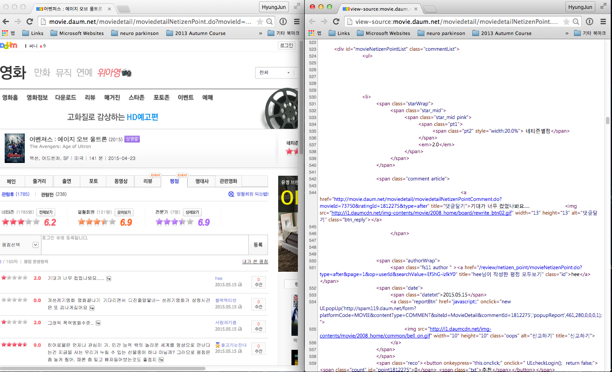

<center></center>

--- .new-background

## 워크숍 관련 온라인 사이트

http://course.mindscale.kr/course/text-analysis

<left></left>

--- .new-background


## 영화 자료를 이용한 다양한 분석

<h3>Topics</h3>
* 주제(topic) 분류 - Text & Self-Rating   
* 개인별 영화 추천 - Text & Self-Rating   
* <font color="red">감정 분석 - Text </font> & Self-Rating

<h3> Method </h3>
* <font color="red"> Visualization</font>  
* Prediction  

<h3> Model </h3>
* Lasso LM / LSA / LDA / Deep Learning  

--- &twocol w1:50% w2:50% .new-background

## 분석 예시 - Text

*** =left
<center></center>

*** =right
<center></center>

--- .new-background

## 분석 예시 - Self-Rating

<center></center>

--- .new-background

## 분석 예시 - Self-Rating & Text

<center></center>

--- .new-background

## 목차

<h4><br></h4>
<h3 style="text-align:left">1. R 기초 세팅</h3>
<h3 style="text-align:left">2. 패키지 인스톨</h3>    
<h3 style="text-align:left">3. 어벤져스 웹크롤</h3>  
<h3 style="text-align:left">4. 감정사전 불러오기</h3>  
<h3 style="text-align:left">5. 키워드 파싱 및 추출</h3>
<h3 style="text-align:left">6. Co-occurrence Matrix</h3>  
<h3 style="text-align:left">7. 시각화</h3>  

--- &twocol w1:40% w2:60% .new-background

## 목차

*** =left
<h4><br></h4>
<h3 style="text-align:left">1. R 기초 세팅</h3>
<h3 style="text-align:left">2. 패키지 인스톨</h3>    
<h3 style="text-align:left">3. 어벤져스 웹크롤</h3>  
<h3 style="text-align:left">4. 감정사전 불러오기</h3>  
<h3 style="text-align:left">5. 키워드 파싱 및 추출</h3>  
<h3 style="text-align:left">6. Co-occurrence Matrix</h3>  
<h3 style="text-align:left">7. 시각화</h3>  

*** =right
<center></center>
---

--- .new-background

<center></center>

--- .dark .segue .nobackground

## 1. R 기초 세팅

--- .new-background

## 1. R 기초 세팅

<h3b><font color="blue"><b> 학습 목표 </b></font></h3b>  
<h3b> - R에서 작업 디렉토리 설정하기</h3b>  
<h3b> - MAC의 경우 그래픽 설정하기</h3b>

--- .new-background

## 1. R 기초 세팅

- MAC


```r
##  사용자 경로
user_path = "/Users/kimhyungjun/Dropbox/repo/daum_movie/mac" 
par(family="AppleGothic")  ##  그림 출력시 한글폰트
```

- Windows


```r
user_path = "C:/Users/kimhyungjun/repo/daum_movie"  
```

- MAC & Windows 공통


```r
setwd(user_path)
```

```

--- .dark .segue .nobackground
## 2. 패키지 인스톨

--- .new-background

## 2. 패키지 인스톨

<h3b><font color="blue"><b> 학습 목표 </b></font></h3b>  
<h3b> - 패키지 인스톨</h3b>  
<h3b> - 패키지 불러오기</h3b>

--- .new-background .modal

## 2. 패키지 인스톨

<h4></br></h4>
<h4></br></h4>

<h4>영화 웹크롤 및 파싱</h4>
* [rvest](http://cran.r-project.org/web/packages/rvest/index.html)  
* [stringr](http://cran.r-project.org/web/packages/stringr/index.html)  

<h4></br></h4>
<h4></br></h4>

<h4>감정 사전 </h4>
<!-- * [readxl](http://cran.r-project.org/web/packages/readxl/index.html)  -->
* [한국어 감정 사전 1](http://word.snu.ac.kr/kosac/)  
* [한국어 감정 사전 2](http://clab.snu.ac.kr/arssa/doku.php?id=app_dict_1.0)  
* [참고 논문 모음 1](http://word.snu.ac.kr/kosac/publications.php)  
* [참고 논문 모음 2](http://clab.snu.ac.kr/arssa/doku.php?id=my_works)  

--- .new-background

## 2. 패키지 인스톨

<h4></br></h4>
<h4></br></h4>

<h4>텍스트 분석</h4>
* [dplyr](http://cran.r-project.org/web/packages/dplyr/index.html)  
* [KoNLP](http://cran.r-project.org/web/packages/KoNLP/index.html)  
* [tm](http://cran.r-project.org/web/packages/tm/index.html)  

<h4></br></h4>
<h4></br></h4>

<h4>네트워크 그래프</h4>
* [qgraph](http://cran.r-project.org/web/packages/qgraph/index.html)  

--- .new-background

## 2. 패키지 인스톨


```r
install.packages(c("rvest","stringr","dplyr","tm","qgraph", "KoNLP"),
                 repos="http://cran.nexr.com")
```

<h4><br></h4>
<h9>패키지 불러오기</h9>


```r
library("httr")
library("rvest")
library("stringr")
library("plyr")
library("tm")
library("qgraph")
library("KoNLP")
```

--- .dark .segue .nobackground

## 3. 어벤져스 웹크롤

--- .new-background

## 3. 어벤져스 웹크롤

<h3b><font color="blue"><b> 학습 목표 </b></font></h3b>  
<h3b> - 웹사이트 배경지식</h3b>  
<!-- <h3b> - Regualr Expression (REGEX)</h3b> -->
<h3b> - 단일 페이지 웹크롤</h3b>  
<h3b> - 복수 페이지 웹크롤</h3b>  

--- .new-background

## 3. 웹사이트 배경지식

- 웹브라우저 열기(e.g. Firefox, Chorme, Safari, Internet Explorer)
- 웹사이트 입력(e.g. http://movie.daum.net)

<h4><br></h4>
- 사용자는 client로 페이지, 이미지, 텍스트를 웹 서버로 요청함
- 웹 서버 사용자에게 반응을 보냄
- 사용자와 웹 서버는 프로토콜(e.g. HTTP)로 커뮤니케이션

--- .new-background .modal

## HTTP

<h4> HTTP? </h4>
- HyperText Transfer Protocal


```r
library("httr")
GET("http://google.com/")  ##  Requset -> Resposne
```

```
## Response [http://www.google.co.kr/?gfe_rd=cr&ei=gP5SVfymLurM8gf-soCABw]
##   Date: 2015-05-13 16:34
##   Status: 200
##   Content-Type: text/html; charset=EUC-KR
##   Size: 18.8 kB
## <!doctype html><html itemscope="" itemtype="http://schema.org/WebPage" l...
## window.google.vel.lu&&window.google.vel.lu(a),d.src=a,google.li=g+1)};go...
## function _gjh(){!_gjuc()&&window.google&&google.x&&google.x({id:"GJH"},f...
## if (!iesg){document.f&&document.f.q.focus();document.gbqf&&document.gbqf...
## }
## })();</script><div id="mngb">    <div id=gbar><nobr><b class=gb1>검색</b> ...
## });})();</script> </div> </span><br clear="all" id="lgpd"><div id="lga">...
```

--- .new-background

## 다음 영화

http://movie.daum.net

<left></left>

--- .new-background

## 소스코드

<left></left>

--- .new-background

## 요소점검

<left></left>

--- .new-background .modal

## 어벤져스 (1 페이지 웹크롤)


```r
urls_view <- "http://movie.daum.net/moviedetail/moviedetailNetizenPoint.do?movieId=73750&searchType=all&type=after&page=1"
htxt <- html(urls_view)
```

--- .new-background .modal


```r
library("rvest")
```


```r
movie_text <- html_nodes(htxt, ".comment")
movie_text
```

[[1]]
<span class="comment article">
					
										<a href="http://movie.daum.net/moviedetail/moviedetailNetizenPointComment.do?movieId=73750&amp;ratingId=1812546&amp;type=after" title="댓글달기">정말 지루한 영화~ 비추                    </a>

					</span> 

[[2]]
<span class="comment article">
					
										<a href="http://movie.daum.net/moviedetail/moviedetailNetizenPointComment.do?movieId=73750&amp;ratingId=1812529&amp;type=after" title="댓글달기">어벤져스2 에서 가장 웃겼던 장면은 아이언맨이 헐크버스터를 입고 헐크랑 싸울때 헐크 눞혀놓고&#13;
왼쪽 주먹으로 콩콩콩 때리면서 기절해~기절해~기절해~ 하면서 때리는 장면....ㅋㅋㅋ                    </a>

					</span> 

[[3]]
<span class="comment article">
					
										<a href="http://movie.daum.net/moviedetail/moviedetailNetizenPointComment.do?movieId=73750&amp;ratingId=1812510&amp;type=after" title="댓글달기">ㅋㅋ 난 아이언맨이 가장 강할줄 알앗는데.. 완전 반전!!&#13;
헐크가 더 쎄...&#13;
역시..                     </a>

					</span> 

[[4]]
<span class="comment article">
					
										<a href="http://movie.daum.net/moviedetail/moviedetailNetizenPointComment.do?movieId=73750&amp;ratingId=1812504&amp;type=after" title="댓글달기">정말 수준 낮고 내용없고 극장의 횡포를  보여준 영화다 다른 영화를 고를 기회를 주지 않는이런 대기업은 망해야한다                    </a>

					</span> 

[[5]]
<span class="comment article">
					
										<a href="http://movie.daum.net/moviedetail/moviedetailNetizenPointComment.do?movieId=73750&amp;ratingId=1812475&amp;type=after" title="댓글달기">사람들 하품하고 옆자리 초딩도 지루하다고..ㅋㅋㅋ 잡다하게 영웅들이 몽땅들 출연해 잔챙이 로봇들과 계속 싸워요 그와중에 느린 활쏘기ㅋ.. 엔딩역시 지리멸렬 무슨 자긍심인지 캐릭터 스스로들 셀프 감동ㅋ 스케일만 크면 좋은 영화인가ㅋ 내용도 하나도 없다ㅋ                    </a>

					</span> 

[[6]]
<span class="comment article">
					
										<a href="http://movie.daum.net/moviedetail/moviedetailNetizenPointComment.do?movieId=73750&amp;ratingId=1812452&amp;type=after" title="댓글달기">진짜 극장 독점 그만좀해라......... 다른영화는 시간대 오전이나 밤이라 볼수가 없네 쓰벌...&#13;
관객이 만아서 스크린 독점한게 아니라 다른거 못보게 스크린 다 차지하니까 울며겨자먹기로&#13;
이것만 볼수박에;;;;;;;;;;;;;;;;;;;;  나도 히어로물 왕팬인데 이건아니지;;;;;;;;;;;;;;&#13;
베트맨이나 스파이더맨 발도 못따라가                    </a>

					</span> 

[[7]]
<span class="comment article">
					
										<a href="http://movie.daum.net/moviedetail/moviedetailNetizenPointComment.do?movieId=73750&amp;ratingId=1812420&amp;type=after" title="댓글달기">그냥 가벼운 소재의 오락물이라고 봄                    </a>

					</span> 

[[8]]
<span class="comment article">
					
										<a href="http://movie.daum.net/moviedetail/moviedetailNetizenPointComment.do?movieId=73750&amp;ratingId=1812413&amp;type=after" title="댓글달기">어벤져스를 잘 모르면, 엄청 재미없을 듯~ 알아도 그저 그런                    </a>

					</span> 

[[9]]
<span class="comment article">
					
										<a href="http://movie.daum.net/moviedetail/moviedetailNetizenPointComment.do?movieId=73750&amp;ratingId=1812411&amp;type=after" title="댓글달기">수현은 극중 비중은 꽤 중요한 역이나 등장씬이 너무 적음                     </a>

					</span> 

[[10]]
<span class="comment article">
					
										<a href="http://movie.daum.net/moviedetail/moviedetailNetizenPointComment.do?movieId=73750&amp;ratingId=1812275&amp;type=after" title="댓글달기">기대가 너무 컸었나봐요.....                    </a>

					</span> 

[[11]]
<span class="comment article">
					
										<a href="http://movie.daum.net/moviedetail/moviedetailNetizenPointComment.do?movieId=73750&amp;ratingId=1812255&amp;type=after" title="댓글달기">개쓰레기영화 영화끝나기 기다리면서 디진줄알앟네~
쓰레기영화가 상영시간은 또 겁나게길어요                    </a>

					</span> 

[[12]]
<span class="comment article">
					
										<a href="http://movie.daum.net/moviedetail/moviedetailNetizenPointComment.do?movieId=73750&amp;ratingId=1812208&amp;type=after" title="댓글달기">그래픽 폭력영화수준..                    </a>

					</span> 

[[13]]
<span class="comment article">
					
										<a href="http://movie.daum.net/moviedetail/moviedetailNetizenPointComment.do?movieId=73750&amp;ratingId=1812189&amp;type=after" title="댓글달기">히어로물은 언제나 관심이 가. 인간 능력 밖의 놀라운 세계를 영상으로 만난다는건 지금을 사는 우리가 누릴 수 있는 선물중에 하나 아닐까? 그러므로 평점은 좀 높게 줬어. 때론 좀 잊고 빠져들어보는것도 좋겠지                    </a>

					</span> 

[[14]]
<span class="comment article">
					
										<a href="http://movie.daum.net/moviedetail/moviedetailNetizenPointComment.do?movieId=73750&amp;ratingId=1812028&amp;type=after" title="댓글달기">꿀잼!!!!!!!!!!!!!!!!!!!!!!!!!!!!!!&#13;
                    </a>

					</span> 

[[15]]
<span class="comment article">
					
										<a href="http://movie.daum.net/moviedetail/moviedetailNetizenPointComment.do?movieId=73750&amp;ratingId=1811988&amp;type=after" title="댓글달기">간만에  재밌는 영화봤어요                    </a>

					</span> 

attr(,"class")
[1] "XMLNodeSet"

--- .new-background


```r
movie_text <- html_nodes(movie_text, "a")
movie_text
```

[[1]]
<a href="http://movie.daum.net/moviedetail/moviedetailNetizenPointComment.do?movieId=73750&amp;ratingId=1812546&amp;type=after" title="댓글달기">정말 지루한 영화~ 비추                    </a> 

[[2]]
<a href="http://movie.daum.net/moviedetail/moviedetailNetizenPointComment.do?movieId=73750&amp;ratingId=1812529&amp;type=after" title="댓글달기">어벤져스2 에서 가장 웃겼던 장면은 아이언맨이 헐크버스터를 입고 헐크랑 싸울때 헐크 눞혀놓고&#13;
왼쪽 주먹으로 콩콩콩 때리면서 기절해~기절해~기절해~ 하면서 때리는 장면....ㅋㅋㅋ                    </a> 

[[3]]
<a href="http://movie.daum.net/moviedetail/moviedetailNetizenPointComment.do?movieId=73750&amp;ratingId=1812510&amp;type=after" title="댓글달기">ㅋㅋ 난 아이언맨이 가장 강할줄 알앗는데.. 완전 반전!!&#13;
헐크가 더 쎄...&#13;
역시..                     </a> 

[[4]]
<a href="http://movie.daum.net/moviedetail/moviedetailNetizenPointComment.do?movieId=73750&amp;ratingId=1812504&amp;type=after" title="댓글달기">정말 수준 낮고 내용없고 극장의 횡포를  보여준 영화다 다른 영화를 고를 기회를 주지 않는이런 대기업은 망해야한다                    </a> 

[[5]]
<a href="http://movie.daum.net/moviedetail/moviedetailNetizenPointComment.do?movieId=73750&amp;ratingId=1812475&amp;type=after" title="댓글달기">사람들 하품하고 옆자리 초딩도 지루하다고..ㅋㅋㅋ 잡다하게 영웅들이 몽땅들 출연해 잔챙이 로봇들과 계속 싸워요 그와중에 느린 활쏘기ㅋ.. 엔딩역시 지리멸렬 무슨 자긍심인지 캐릭터 스스로들 셀프 감동ㅋ 스케일만 크면 좋은 영화인가ㅋ 내용도 하나도 없다ㅋ                    </a> 

[[6]]
<a href="http://movie.daum.net/moviedetail/moviedetailNetizenPointComment.do?movieId=73750&amp;ratingId=1812452&amp;type=after" title="댓글달기">진짜 극장 독점 그만좀해라......... 다른영화는 시간대 오전이나 밤이라 볼수가 없네 쓰벌...&#13;
관객이 만아서 스크린 독점한게 아니라 다른거 못보게 스크린 다 차지하니까 울며겨자먹기로&#13;
이것만 볼수박에;;;;;;;;;;;;;;;;;;;;  나도 히어로물 왕팬인데 이건아니지;;;;;;;;;;;;;;&#13;
베트맨이나 스파이더맨 발도 못따라가                    </a> 

[[7]]
<a href="http://movie.daum.net/moviedetail/moviedetailNetizenPointComment.do?movieId=73750&amp;ratingId=1812420&amp;type=after" title="댓글달기">그냥 가벼운 소재의 오락물이라고 봄                    </a> 

[[8]]
<a href="http://movie.daum.net/moviedetail/moviedetailNetizenPointComment.do?movieId=73750&amp;ratingId=1812413&amp;type=after" title="댓글달기">어벤져스를 잘 모르면, 엄청 재미없을 듯~ 알아도 그저 그런                    </a> 

[[9]]
<a href="http://movie.daum.net/moviedetail/moviedetailNetizenPointComment.do?movieId=73750&amp;ratingId=1812411&amp;type=after" title="댓글달기">수현은 극중 비중은 꽤 중요한 역이나 등장씬이 너무 적음                     </a> 

[[10]]
<a href="http://movie.daum.net/moviedetail/moviedetailNetizenPointComment.do?movieId=73750&amp;ratingId=1812275&amp;type=after" title="댓글달기">기대가 너무 컸었나봐요.....                    </a> 

[[11]]
<a href="http://movie.daum.net/moviedetail/moviedetailNetizenPointComment.do?movieId=73750&amp;ratingId=1812255&amp;type=after" title="댓글달기">개쓰레기영화 영화끝나기 기다리면서 디진줄알앟네~
쓰레기영화가 상영시간은 또 겁나게길어요                    </a> 

[[12]]
<a href="http://movie.daum.net/moviedetail/moviedetailNetizenPointComment.do?movieId=73750&amp;ratingId=1812208&amp;type=after" title="댓글달기">그래픽 폭력영화수준..                    </a> 

[[13]]
<a href="http://movie.daum.net/moviedetail/moviedetailNetizenPointComment.do?movieId=73750&amp;ratingId=1812189&amp;type=after" title="댓글달기">히어로물은 언제나 관심이 가. 인간 능력 밖의 놀라운 세계를 영상으로 만난다는건 지금을 사는 우리가 누릴 수 있는 선물중에 하나 아닐까? 그러므로 평점은 좀 높게 줬어. 때론 좀 잊고 빠져들어보는것도 좋겠지                    </a> 

[[14]]
<a href="http://movie.daum.net/moviedetail/moviedetailNetizenPointComment.do?movieId=73750&amp;ratingId=1812028&amp;type=after" title="댓글달기">꿀잼!!!!!!!!!!!!!!!!!!!!!!!!!!!!!!&#13;
                    </a> 

[[15]]
<a href="http://movie.daum.net/moviedetail/moviedetailNetizenPointComment.do?movieId=73750&amp;ratingId=1811988&amp;type=after" title="댓글달기">간만에  재밌는 영화봤어요                    </a> 

attr(,"class")
[1] "XMLNodeSet"

--- .new-background 


```r
movie_text <- html_text(movie_text)
movie_text
```

 [1] "정말 지루한 영화~ 비추                    "                                                                                                                                                                                                                                                                                           
 [2] "어벤져스2 에서 가장 웃겼던 장면은 아이언맨이 헐크버스터를 입고 헐크랑 싸울때 헐크 눞혀놓고\r\n왼쪽 주먹으로 콩콩콩 때리면서 기절해~기절해~기절해~ 하면서 때리는 장면....ㅋㅋㅋ                    "                                                                                                                                   
 [3] "ㅋㅋ 난 아이언맨이 가장 강할줄 알앗는데.. 완전 반전!!\r\n헐크가 더 쎄...\r\n역시..                     "                                                                                                                                                                                                                              
 [4] "정말 수준 낮고 내용없고 극장의 횡포를  보여준 영화다 다른 영화를 고를 기회를 주지 않는이런 대기업은 망해야한다                    "                                                                                                                                                                                                   
 [5] "사람들 하품하고 옆자리 초딩도 지루하다고..ㅋㅋㅋ 잡다하게 영웅들이 몽땅들 출연해 잔챙이 로봇들과 계속 싸워요 그와중에 느린 활쏘기ㅋ.. 엔딩역시 지리멸렬 무슨 자긍심인지 캐릭터 스스로들 셀프 감동ㅋ 스케일만 크면 좋은 영화인가ㅋ 내용도 하나도 없다ㅋ                    "                                                           
 [6] "진짜 극장 독점 그만좀해라......... 다른영화는 시간대 오전이나 밤이라 볼수가 없네 쓰벌...\r\n관객이 만아서 스크린 독점한게 아니라 다른거 못보게 스크린 다 차지하니까 울며겨자먹기로\r\n이것만 볼수박에;;;;;;;;;;;;;;;;;;;;  나도 히어로물 왕팬인데 이건아니지;;;;;;;;;;;;;;\r\n베트맨이나 스파이더맨 발도 못따라가                    "
 [7] "그냥 가벼운 소재의 오락물이라고 봄                    "                                                                                                                                                                                                                                                                               
 [8] "어벤져스를 잘 모르면, 엄청 재미없을 듯~ 알아도 그저 그런                    "                                                                                                                                                                                                                                                         
 [9] "수현은 극중 비중은 꽤 중요한 역이나 등장씬이 너무 적음                     "                                                                                                                                                                                                                                                          
[10] "기대가 너무 컸었나봐요.....                    "                                                                                                                                                                                                                                                                                      
[11] "개쓰레기영화 영화끝나기 기다리면서 디진줄알앟네~\n쓰레기영화가 상영시간은 또 겁나게길어요                    "                                                                                                                                                                                                                        
[12] "그래픽 폭력영화수준..                    "                                                                                                                                                                                                                                                                                            
[13] "히어로물은 언제나 관심이 가. 인간 능력 밖의 놀라운 세계를 영상으로 만난다는건 지금을 사는 우리가 누릴 수 있는 선물중에 하나 아닐까? 그러므로 평점은 좀 높게 줬어. 때론 좀 잊고 빠져들어보는것도 좋겠지                    "                                                                                                           
[14] "꿀잼!!!!!!!!!!!!!!!!!!!!!!!!!!!!!!\r\n                    "                                                                                                                                                                                                                                                                           
[15] "간만에  재밌는 영화봤어요                    "                                                                                                                                                                                                                                                                                        

--- .new-background

## 어벤져스 (1 페이지 웹크롤)


```r
urls_view <- "http://movie.daum.net/moviedetail/moviedetailNetizenPoint.do?movieId=73750&searchType=all&type=after&page=1"
htxt <- html(urls_view)
movie_text <- html_nodes(htxt, ".comment")
movie_text <- html_nodes(movie_text, "a")
movie_text <- html_text(movie_text)
length(html_nodes(htxt, ".comment"))
```

```
## [1] 15
```

--- .dark .segue .nobackground

## R 연습 - FOR & IF, paste

--- .new-background .modal

## FOR & IF, break (연습 1)


```r
for (i in 1:5)
{
    print(i)
}
```

```
## [1] 1
## [1] 2
## [1] 3
## [1] 4
## [1] 5
```


```r
for (i in 1:100)
{
    if(i==3) break
    print(i)
}
```

```
## [1] 1
## [1] 2
```

--- .new-background

## c, paste (연습 2)


```r
ex1 <- c("어벤져스 재밌다")
ex2 <- c("졸리다")
ex_sum <- c(ex1, ex2)
ex_sum
```

```
## [1] "어벤져스 재밌다" "졸리다"
```

--- .new-background .modal

## c, paste (연습 2)


```r
paste("page=", 1)
```

```
## [1] "page= 1"
```

```r
paste("page=", 1, sep="")
```

```
## [1] "page=1"
```


```r
page_num = 1
paste("page=", page_num, sep="")
```

```
## [1] "page=1"
```

```r
page_num = 2
paste("page=", page_num, sep="")
```

```
## [1] "page=2"
```

--- .new-background

## c, paste (연습 2)


```r
ex <- c("어벤져스", ex2)
paste(ex, collapse="")
```

```
## [1] "어벤져스졸리다"
```

```r
paste(ex, collapse=" ")
```

```
## [1] "어벤져스 졸리다"
```

```r
paste(ex, collapse=" + ")
```

```
## [1] "어벤져스 + 졸리다"
```

--- .new-background


```r
urls_view <- "http://movie.daum.net/moviedetail/moviedetailNetizenPoint.do?movieId=73750&searchType=all&type=after&page=130"
r <- GET(urls_view)
htxt <- html(r)
length(html_nodes(htxt, ".comment"))
```

```
## [1] 0
```


--- .new-background .modal

## 어벤져스 전체 페이지 웹크롤


```r
movie_text_sum <- c()

for (page_num in 1:1000)
{
urls_view <- 
paste("http://movie.daum.net/moviedetail/moviedetailNetizenPoint.do?movieId=73750&searchType=all&type=after&page=",
page_num,sep="")
htxt <- html(urls_view)

movie_text <-  html_nodes(htxt, ".comment")
movie_text <-  html_nodes(movie_text, "a")
movie_text <-  html_text(movie_text)

if(length(movie_text)==0) break;

movie_text_sum <- c(movie_text_sum, movie_text)
print(paste(page_num, "-th page", sep=""))    
}
```

--- .dark .segue .nobackground

## 4. 감정사전 불러오기

--- .new-background

## 4. 감정사전 불러오기

<h3b><font color="blue"><b> 학습 목표 </b></font></h3b>  
<h3b> - 파일 불러오기(read.csv)</h3b>  
<h3b> - 긍정 사전과 부정 사전으로 분할(subset)</h3b>

--- .new-background

## 4. 감정사전 불러오기


```r
emotion_dict <- read.csv("emotion_dict.csv", 
                         header = T, 
                         fileEncoding = "UTF-8",
                         stringsAsFactors = F)
```


```r
pos_word <- subset(emotion_dict, pos_neg=="pos")[,"words"]
neg_word <- subset(emotion_dict, pos_neg=="neg")[,"words"]
#emotion_dict[11:15,]; emotion_dict[1301:1305,];
```

<h4><br></h4>
[감정사전](https://www.dropbox.com/s/okv4mjiq0wlhgbl/emotion_dict.csv?dl=0)

--- .dark .segue .nobackground

## 5. 키워드 파싱 및 추출

--- .new-background

## 5. 키워드 파싱 및 추출

<h3b><font color="blue"><b> 학습 목표 </b></font></h3b>  

<h3b> - R에서 자연어 처리 문제</h3b>  

<h3b> - 키워드 추출 방법 I (KoNLP - ExtracNoun)</h3b>

<h3b> - 키워드 추출 방법 II (KoNLP - POStagging) - APPENDIX II </h3b>  

<h3b> - 키워드 추출 방법 III (앞 두 글자 자르기) - APPENDIX III </h3b>

--- .new-background

## R에서 자연어 처리 (KoNLP)

<font color="red">기대</font>했던 것보다 좀 <font color="red">지루</font>했음... 와이프는 
<font color="red">재미있다</font>고...


```r
library("KoNLP")
extractNoun("기대했던 것보다 좀 지루했음... 와이프는 재미있다고...")
```

```
## [1] "것"     "지루"   "와이프"
```


```r
split_12("기대했던 것보다 좀 지루했음... 와이프는 재미있다고...")
```

```
## [1] "기대" "것보" "좀"   "지루" "와이" "재미"
```


```r
extractNounVerbAdj("기대했던 것보다 좀 지루했음... 와이프는 재미있다고...")
```

```
## [[1]]
## [1] ""       "기대"   "하"     "것"     "지루"   "와이프" "재미있" ""
```

--- .dark .segue .nobackground

## R 연습 - extractNoun, nchar, revalue

--- .new-background

## extractNoun (연습 3)


```r
ex <- "어 헐크 대박이네 ㅋ 잼슴"
ex <- extractNoun(ex)
ex
```

```
## [1] "어"   "헐크" "대박" "ㅋ"   "잼슴"
```

--- .new-background

## nchar로 1글자 제거 (연습 4)


```r
ex
```

```
## [1] "어"   "헐크" "대박" "ㅋ"   "잼슴"
```

```r
nchar(ex)
```

```
## [1] 1 2 2 1 2
```

```r
ex <- ex[nchar(ex) > 1]
ex
```

```
## [1] "헐크" "대박" "잼슴"
```

--- .new-background

## revalue로 맞춤법 교정 (연습 5)


```r
ex
```

```
## [1] "헐크" "대박" "잼슴"
```


```r
library("plyr")
```


```r
revalue(ex, c("잼슴" ="재미"))
```

```
## [1] "헐크" "대박" "재미"
```


```r
revalue(ex, c("대박"="완전", "잼슴"="재미"))
```

```
## [1] "헐크" "완전" "재미"
```

--- .new-background

## 키워드 추출 (어벤져스)

* Step (1) extractNoun


```r
movie_text_sum[1]
```

```
## [1] "괜찮음.. 시원한 액션.. 갠적으로 캡틴아메리카 너무 좋아함. 헐크도 좋고.. ♥♥♥"
```

```r
key_vec <- extractNoun(movie_text_sum[1])
key_vec
```

```
## [1] "시원"         "한"           "액션"         "적"          
## [5] "캡틴아메리카" "헐크도"       "♥♥♥"
```

--- .new-background

## 키워드 추출 (어벤져스)

* Step (2) 한 글자 제거


```r
key_vec <- key_vec[nchar(key_vec) > 1]
key_vec
```

```
## [1] "시원"         "액션"         "캡틴아메리카" "헐크도"      
## [5] "♥♥♥"
```

--- .new-background

## 키워드 추출 (어벤져스)

* Step (3) 맞춤법 교정


```r
movie_name <- "어벤져스"
key_vec <- revalue(key_vec, c("재밌" = "재미",
                              "재밋" = "재미",
                              "잼있" = "재미",
                              "영화" = movie_name),
                   warn_missing = F)
key_vec
```

```
## [1] "시원"         "액션"         "캡틴아메리카" "헐크도"      
## [5] "♥♥♥"
```

--- .new-background

## 키워드 추출 (어벤져스)

* Step (4) 다시 한 문장으로 합치기


```r
key_vec <- paste(key_vec, collapse=" ")
key_vec
```

```
## [1] "시원 액션 캡틴아메리카 헐크도 ♥♥♥"
```

--- .new-background .modal

## 키워드 추출 (어벤져스)


```r
key_vec_sum <- c(); 
movie_name = "어벤져스"

for (i in 1:length(movie_text_sum))
{
key_vec <- extractNoun(movie_text_sum[i])

key_vec <- revalue(key_vec, c("재밌" = "재미",
                              "재밋" = "재미",
                              "잼있" = "재미",
                              "영화" = movie_name),
                   warn_missing = F)

key_vec <- key_vec[nchar(key_vec) > 1]
key_vec <- c(key_vec, ' ')  ##  윈도우 tm 버그 때문
key_vec_sum[i] <- paste(key_vec, collapse='  ')  ##  두 칸 (윈도우 tm 버그 때문)
}
```

```
## Warning: It's not kind of right sentence : '재미겁나.없음.스토리자체가어거지로맞츠는데, '
## Warning: It's not kind of right sentence : '꾸벅꾸벅...........억지로봤네요.........'
## Warning: It's not kind of right sentence : '저는개인적으로1편보단재밌게봤습니다솔직히첨부분은지루한점은있었는데중반부터재밌더라고요역시CG가대단합니다.서울에서찍은장면도기대이상이였습니다'
## Warning: It's not kind of right sentence : '재미없다는사람들대체이때까지어떤영화를본거지....핵꿀잼이던데...'
## Warning: It's not kind of right sentence : '그냥자다가다시일어나서보고ㅜ별로모르겟음ㅜㅜ'
## Warning: It's not kind of right sentence : '계속지네들끼리싸우다가적하고싸우다가또지들끼리싸운다...그러다또적하고싸우고ㅡㅡ지루한건사실이다..새로운인물들이나타날때마다몰입도는떨어져갔다..그러나한국을알리는데는도움이될거같았다..씬도어느정도중요했고..음..딱히재미있는영화라고는못하겠다..그냥그냥볼만한영화?ㅎ그이상그이하도아닌거같았다'
```

--- .dark .segue .nobackground

## 6. Co-occurrence Matrix

--- .new-background

## 6. Co-occurrence Matrix

<h3b><font color="blue"><b> 학습 목표 </b></font></h3b>  
<h3b> - Term x Document Matrix</h3b>  
<h3b> - Co-occurrence Matrix</h3b>

--- .new-background

## Term x Document Matrix

* 행(row)은 Term(단어들), 열(col)은 Document(개인들)로 이루어진 Matrix
* 단어에 대하여 Weight
* 문서 내 단어에 대하여 Weight 
* 모형에 따라 다양한 방식으로 처리


```r
library("tm")
```


```r
key_corpus <- Corpus(DataframeSource(as.data.frame(key_vec_sum)))
key_corpus
```

```
## <<VCorpus (documents: 1737, metadata (corpus/indexed): 0/0)>>
```

--- .new-background

## Term x Document Matrix


```r
key_tdm <- TermDocumentMatrix(key_corpus)
key_tdm
```

```
## <<TermDocumentMatrix (terms: 3442, documents: 1737)>>
## Non-/sparse entries: 5632/5973122
## Sparsity           : 100%
## Maximal term length: 152
## Weighting          : term frequency (tf)
```

--- .new-background .modal

## Term x Document Matrix


```r
rownames(key_tdm)[rownames(key_tdm)=="어벤져스"]
```

```
## [1] "어벤져스"
```

```r
rownames(key_tdm)[rownames(key_tdm)=="헐크"]
```

```
## character(0)
```

```r
rownames(key_tdm)[rownames(key_tdm)=="등등"]
```

```
## character(0)
```

```r
rownames(key_tdm)[rownames(key_tdm)=="ㅡ.ㅡ"]
```

```
## [1] "ㅡ.ㅡ"
```


--- .new-background

## Term x Document Matrix


```r
key_tdm <- TermDocumentMatrix(key_corpus,
                              control = list(
                              removeNumbers = TRUE,
                              removePunctuation = TRUE))
```

--- .new-background .modal

## Term x Document Matrix


```r
rownames(key_tdm)[rownames(key_tdm)=="어벤져스"]
```

```
## [1] "어벤져스"
```

```r
rownames(key_tdm)[rownames(key_tdm)=="헐크"]
```

```
## character(0)
```

```r
rownames(key_tdm)[rownames(key_tdm)=="등등"]
```

```
## character(0)
```

```r
rownames(key_tdm)[rownames(key_tdm)=="ㅡ.ㅡ"]
```

```
## character(0)
```

--- .new-background

## Term x Document Matrix


```r
?TermDocumentMatrix
?TermFreq
```

--- .new-background

## Term x Document Matrix


```r
key_tdm <- TermDocumentMatrix(key_corpus,
                              control = list(
                              removeNumbers = TRUE,
                              removePunctuation = TRUE,
                              wordLengths = c(2,Inf)))
```

--- .new-background .modal

## Term x Document Matrix


```r
rownames(key_tdm)[rownames(key_tdm)=="어벤져스"]
```

```
## [1] "어벤져스"
```

```r
rownames(key_tdm)[rownames(key_tdm)=="헐크"]
```

```
## [1] "헐크"
```

```r
rownames(key_tdm)[rownames(key_tdm)=="등등"]
```

```
## [1] "등등"
```

```r
rownames(key_tdm)[rownames(key_tdm)=="ㅡ.ㅡ"]
```

```
## character(0)
```

--- .new-background

## 불필요 단어제거


```r
stopwords()
```

```
##   [1] "i"          "me"         "my"         "myself"     "we"        
##   [6] "our"        "ours"       "ourselves"  "you"        "your"      
##  [11] "yours"      "yourself"   "yourselves" "he"         "him"       
##  [16] "his"        "himself"    "she"        "her"        "hers"      
##  [21] "herself"    "it"         "its"        "itself"     "they"      
##  [26] "them"       "their"      "theirs"     "themselves" "what"      
##  [31] "which"      "who"        "whom"       "this"       "that"      
##  [36] "these"      "those"      "am"         "is"         "are"       
##  [41] "was"        "were"       "be"         "been"       "being"     
##  [46] "have"       "has"        "had"        "having"     "do"        
##  [51] "does"       "did"        "doing"      "would"      "should"    
##  [56] "could"      "ought"      "i'm"        "you're"     "he's"      
##  [61] "she's"      "it's"       "we're"      "they're"    "i've"      
##  [66] "you've"     "we've"      "they've"    "i'd"        "you'd"     
##  [71] "he'd"       "she'd"      "we'd"       "they'd"     "i'll"      
##  [76] "you'll"     "he'll"      "she'll"     "we'll"      "they'll"   
##  [81] "isn't"      "aren't"     "wasn't"     "weren't"    "hasn't"    
##  [86] "haven't"    "hadn't"     "doesn't"    "don't"      "didn't"    
##  [91] "won't"      "wouldn't"   "shan't"     "shouldn't"  "can't"     
##  [96] "cannot"     "couldn't"   "mustn't"    "let's"      "that's"    
## [101] "who's"      "what's"     "here's"     "there's"    "when's"    
## [106] "where's"    "why's"      "how's"      "a"          "an"        
## [111] "the"        "and"        "but"        "if"         "or"        
## [116] "because"    "as"         "until"      "while"      "of"        
## [121] "at"         "by"         "for"        "with"       "about"     
## [126] "against"    "between"    "into"       "through"    "during"    
## [131] "before"     "after"      "above"      "below"      "to"        
## [136] "from"       "up"         "down"       "in"         "out"       
## [141] "on"         "off"        "over"       "under"      "again"     
## [146] "further"    "then"       "once"       "here"       "there"     
## [151] "when"       "where"      "why"        "how"        "all"       
## [156] "any"        "both"       "each"       "few"        "more"      
## [161] "most"       "other"      "some"       "such"       "no"        
## [166] "nor"        "not"        "only"       "own"        "same"      
## [171] "so"         "than"       "too"        "very"
```

--- .new-background

## Term x Document Matrix

* 해석이 힘든 단어들을 Term x Document Matrix 생성 시 제거


```r
delete_dic <- c("그냥", "등등", "중간")
```

--- .new-background

## Term x Document Matrix


```r
key_tdm <- TermDocumentMatrix(key_corpus,
                              control = list(
                              removeNumbers = TRUE,
                              removePunctuation = TRUE,
                              wordLengths = c(2,Inf),
                              stopwords = delete_dic))
```

--- .new-background .modal

## Term x Document Matrix


```r
rownames(key_tdm)[rownames(key_tdm)=="어벤져스"]
```

```
## [1] "어벤져스"
```

```r
rownames(key_tdm)[rownames(key_tdm)=="헐크"]
```

```
## [1] "헐크"
```

```r
rownames(key_tdm)[rownames(key_tdm)=="등등"]
```

```
## character(0)
```

```r
rownames(key_tdm)[rownames(key_tdm)=="ㅡ.ㅡ"]
```

```
## character(0)
```

--- .new-background

## Term x Document Matrix


```r
key_tdm_m <- as.matrix(key_tdm)
rownames(key_tdm_m) <- str_trim(rownames(key_tdm_m))  ##  for windows
dim(key_tdm)
```

```
## [1] 4940 1737
```

--- .new-background

## Term x Document Matrix

* 행(row)은 Term(단어들), 열(col)은 Document(개인들)로 이루어진 Matrix


```r
ex <- matrix(c(1,1,1,0,
               1,0,1,0,
               0,1,0,1), 
               nrow=4)
rownames(ex) <- c("아이폰", "갤럭시", "좋다", "나쁘다")
colnames(ex) <- c("사람1", "사람2", "사람3")
```

--- .new-background

## Co-occurrence Matrix

* 특정 단어와 다른 단어가 동시에 영화평 내에서 발생한 것을 Counts
* 예시)


```r
ex %*% t(ex)
```

```
##        아이폰 갤럭시 좋다 나쁘다
## 아이폰      2      1    2      0
## 갤럭시      1      2    1      1
## 좋다        2      1    2      0
## 나쁘다      0      1    0      1
```

--- .new-background .modal

## Co-occurrence Matrix


```r
rowSums(key_tdm_m)[1:5]
```

```
##            and an개인적으로는       avengers            bad            bbb 
##              2              1              1              1              1
```

```r
order(rowSums(key_tdm_m), decreasing = T)[1:5]
```

```
## [1] 2797 3584 4013  528 2292
```

```r
key_tdm_m <- key_tdm_m[order(rowSums(key_tdm_m), decreasing = T),]
```

--- .new-background .modal

## Co-occurrence Matrix


```r
key_tdm_m <- key_tdm_m[1:20, ]
co_matrix <- key_tdm_m %*% t(key_tdm_m)
co_matrix[1:5,1:5]
```

```
##           Terms
## Terms      어벤져스 재미 지루 기대 스토리
##   어벤져스      988  104   75   66     99
##   재미          104  282   35   29     24
##   지루           75   35  212   28     25
##   기대           66   29   28  206     11
##   스토리         99   24   25   11    192
```

--- .new-background

## Term x Document Matrix와 감정 사전


```r
groups_list = list()
groups_list$비호감단어 = which(rownames(co_matrix) %in% neg_word)
groups_list$호감단어 = which(rownames(co_matrix) %in% pos_word)
groups_list
```

```
## $비호감단어
## [1]  3 18 20
## 
## $호감단어
## [1] 2 4
```

--- .dark .segue .nobackground

## 7. 시각화

--- .new-background

## 7. 시각화

<h3b><font color="blue"><b> 학습 목표 </b></font></h3b>  
<h3b> - Graph 그리기(qgraph)</h3b>  

--- .new-background

## Graph


```r
library("qgraph")
```


```r
qgraph(co_matrix, labels = rownames(co_matrix), diag=F)
```

--- .new-background

<center></center>

--- .new-background


```r
qgraph(co_matrix, labels = rownames(co_matrix), diag=F,
      layout="spring")
```

--- .new-background

<center></center>

--- .new-background


```r
qgraph(co_matrix, labels = rownames(co_matrix), diag=F,
      layout="spring", 
      edge.color = "darkblue")
```

--- .new-background

<center></center>

--- .new-background


```r
qgraph(co_matrix, labels = rownames(co_matrix), diag=F,
      layout="spring", 
      edge.color = "darkblue",
      groups = groups_list)
```

--- .new-background

<center></center>

--- .new-background


```r
qgraph(co_matrix, labels = rownames(co_matrix), diag=F,
      layout = "spring", 
      edge.color = "darkblue",
      groups = groups_list,
      vsize = 5,
      legend.cex = .7)
      
title(movie_name, line = 3)
```

--- .new-background

<center></center>

--- .new-background


```r
qgraph(co_matrix, labels = rownames(co_matrix), diag=F,
      layout = "spring", 
      edge.color = "darkblue",
      groups = groups_list,
      vsize = log(diag(co_matrix)),
      legend.cex = .7)

title(movie_name, line = 3)
```

--- .new-background

<center></center>

--- .new-background

## 의문 단어 찾아보기(상관관계)


```r
head(findAssocs(key_tdm, "서울", 0))
```

```
##          서울
## 후진국   0.31
## 배경     0.28
## 이미지가 0.27
## 건물외관 0.25
## 뉴스방송 0.25
## 당근     0.25
```

--- .new-background

## 의문 단어 찾아보기(상관관계)


```r
head(findAssocs(key_tdm, "다음", 0))
```

```
##            다음
## 검색       0.36
## 개봉많이   0.35
## 네이버보다 0.35
## 물타기알바 0.35
## 본사람들   0.35
## 빵점       0.35
```


--- .dark .segue .nobackground

## APPENDIX I - R 연습 (REGEX)

--- .new-background .modal

## REGEX (연습 1)


```r
ex <- c("아!! R이 왜 이렇게 재미있냐?", "[1]", "[2]", "[20]", "졸리다...")
str_replace_all(ex, '!', '')
```

```
## [1] "아 R이 왜 이렇게 재미있냐?" "[1]"                       
## [3] "[2]"                        "[20]"                      
## [5] "졸리다..."
```

```r
str_replace_all(ex, "! | \\.", "")
```

```
## [1] "아!R이 왜 이렇게 재미있냐?" "[1]"                       
## [3] "[2]"                        "[20]"                      
## [5] "졸리다..."
```

```r
str_replace_all(ex, "[[:punct:]]", "")
```

```
## [1] "아 R이 왜 이렇게 재미있냐" "1"                        
## [3] "2"                         "20"                       
## [5] "졸리다"
```

--- .new-background .modal

## REGEX (연습 1)


```r
str_replace_all(ex, "1", "")
```

```
## [1] "아!! R이 왜 이렇게 재미있냐?" "[]"                          
## [3] "[2]"                          "[20]"                        
## [5] "졸리다..."
```

```r
str_replace_all(ex, "[1]", "")
```

```
## [1] "아!! R이 왜 이렇게 재미있냐?" "[]"                          
## [3] "[2]"                          "[20]"                        
## [5] "졸리다..."
```

```r
str_replace_all(ex, "\\[1\\]", "")
```

```
## [1] "아!! R이 왜 이렇게 재미있냐?" ""                            
## [3] "[2]"                          "[20]"                        
## [5] "졸리다..."
```

--- .new-background .modal

## REGEX (연습 1)


```r
?regex
```

--- .new-background

## REGEX (연습 1)


```r
str_replace_all(ex, "\\[[0-9]\\]", "")
```

```
## [1] "아!! R이 왜 이렇게 재미있냐?" ""                            
## [3] ""                             "[20]"                        
## [5] "졸리다..."
```

```r
str_replace_all(ex, "\\[[0-9]+\\]", "")
```

```
## [1] "아!! R이 왜 이렇게 재미있냐?" ""                            
## [3] ""                             ""                            
## [5] "졸리다..."
```

--- .new-background .modal

## REGEX (연습 1)


```r
ex <- str_replace_all(ex, "\\[[0-9]+\\]", "")
```


```r
ex==""
```

```
## [1] FALSE  TRUE  TRUE  TRUE FALSE
```

```r
ex!=""
```

```
## [1]  TRUE FALSE FALSE FALSE  TRUE
```

```r
ex[ex!=""]
```

```
## [1] "아!! R이 왜 이렇게 재미있냐?" "졸리다..."
```


--- .dark .segue .nobackground

## APPENDIX II  - POS-TAGGING 이용 

## R 연습

--- .new-background

## 문장 자르기(split) (연습 3)


```r
ex <- "기대보다 아주 재밌음!!!!!!!! !! 꼭 봐요~ > < *"
```


```r
result <- str_split(ex, "([ㄱ-ㅎㅏ-ㅢ]|[[:punct:]]|[0-9A-Za-z]|[[:space:]])+" )
result
```

```
## [[1]]
## [1] "기대보다" "아주"     "재밌음"   "꼭"       "봐요"     ""
```

--- .new-background

## 앞 2글자 추출 (연습 4)


```r
result <- str_sub(result[[1]], 1, 2)
result
```

```
## [1] "기대" "아주" "재밌" "꼭"   "봐요" ""
```

--- .new-background

## 맞춤법 교정 (연습 5)


```r
plyr::revalue("재밌", c("재밌" =  "재미", "재믿" = "재미"), warn_missing=F)
```

```
## [1] "재미"
```

```r
plyr::revalue(result, c("재밌" =  "재미", "재믿" = "재미"), warn_missing=F)
```

```
## [1] "기대" "아주" "재미" "꼭"   "봐요" ""
```

--- .new-background

## 한 문장으로 합치기 (연습 6)


```r
paste(c("하", "R은", "정말", "신나"), sep= ' ')
```

```
## [1] "하"   "R은"  "정말" "신나"
```

```r
paste(c("하", "R은", "정말", "신나"), collapse=" ")
```

```
## [1] "하 R은 정말 신나"
```

```r
paste(c("하", "R은", "정말", "신나"), collapse="+")
```

```
## [1] "하+R은+정말+신나"
```

--- .new-background .modal

## POS Tagging (연습 7)


```r
SimplePos09(ex)
```

```
## $기대보다
## [1] "기대/N+보다/J"
## 
## $아주
## [1] "아주/M"
## 
## $재밌음
## [1] "재밌음/N"
## 
## $`!!!!!`
## [1] "!!!!!/S"
## 
## $`!!!`
## [1] "!!!/S"
## 
## $`!!`
## [1] "!!/S"
## 
## $꼭
## [1] "꼭/M"
## 
## $`봐요~`
## [1] "보/P+아/E+~/S"
## 
## $`>`
## [1] ">/S"
## 
## $`<`
## [1] "</S"
## 
## $`*`
## [1] "*/S"
```

--- .new-background .modal

## POS Tagging (연습 7)

[태그 메뉴얼(pp.16 ~ 17)](http://kldp.net/projects/hannanum/forum/316173)


```r
result <- paste(SimplePos09(ex))
result
```

```
##  [1] "기대/N+보다/J" "아주/M"        "재밌음/N"      "!!!!!/S"      
##  [5] "!!!/S"         "!!/S"          "꼭/M"          "보/P+아/E+~/S"
##  [9] ">/S"           "</S"           "*/S"
```

--- .new-background .modal

## POS Tagging (연습 7)

- 체언(N)과 용언(P)만 추출  
- 체언(N) : 보통명사 + 고유명사 + 의존명사 + 대명사 + 수사  
- 용언(P) : 동사 + 형용사 + 보조용언


```r
result <- str_extract_all(result,"[가-힣]+/P|[가-힣]+/N")
result
```

```
## [[1]]
## [1] "기대/N"
## 
## [[2]]
## character(0)
## 
## [[3]]
## [1] "재밌음/N"
## 
## [[4]]
## character(0)
## 
## [[5]]
## character(0)
## 
## [[6]]
## character(0)
## 
## [[7]]
## character(0)
## 
## [[8]]
## [1] "보/P"
## 
## [[9]]
## character(0)
## 
## [[10]]
## character(0)
## 
## [[11]]
## character(0)
```

--- .new-background .modal

## 체언과 용언 추출 (연습 8)


```r
result <- paste(result, collapse = " ")
result
```

```
## [1] "기대/N character(0) 재밌음/N character(0) character(0) character(0) character(0) 보/P character(0) character(0) character(0)"
```

--- .new-background .modal

## 체언과 용언 추출 (연습 8)


```r
result <- str_split(result,"([ㄱ-ㅎㅏ-ㅢ]|[[:punct:]]|[0-9A-Za-z]|[[:space:]])+")
result
```

```
## [[1]]
## [1] "기대"   "재밌음" "보"     ""
```

```r
ex  ##  앞 두 글자가 오히려 좋을 수도
```

```
## [1] "기대보다 아주 재밌음!!!!!!!! !! 꼭 봐요~ > < *"
```

```r
split_12(ex)
```

```
## [1] "기대" "아주" "재밌" "!!"   "꼭"   "봐요" ">"    "<"    "*"
```

--- .new-background

## 키워드 추출 (어벤져스)

* Step (1) POS Tagging


```r
movie_text_sum[1]
```

```
## [1] "괜찮음.. 시원한 액션.. 갠적으로 캡틴아메리카 너무 좋아함. 헐크도 좋고.. ♥♥♥"
```

```r
key_vec <- SimplePos09(movie_text_sum[1])
key_vec <- paste(SimplePos09(movie_text_sum[1]),"")
key_vec
```

```
##  [1] "괜찮/P+음/E "           "../S "                 
##  [3] "시원한/N "              "액션/N "               
##  [5] "../S "                  "개/P+ㄴ/E+적/N+으로/J "
##  [7] "캡틴아메리카/N "        "너무/M "               
##  [9] "좋/P+아/E+하/P+ㅁ/E "   "./S "                  
## [11] "헐크도/N "              "좋/P+고/E "            
## [13] "../S "                  "♥♥♥/N "
```

--- .new-background

## 키워드 추출 (어벤져스)

* Step (2) 체언(N)과 용언(P) 추출


```r
key_vec <- str_extract_all(key_vec,"[가-힣]+/P|[가-힣]+/N")
key_vec <- paste(key_vec, collapse=" ")
key_vec
```

```
## [1] "괜찮/P character(0) 시원한/N 액션/N character(0) c(\"개/P\", \"적/N\") 캡틴아메리카/N character(0) c(\"좋/P\", \"하/P\") character(0) 헐크도/N 좋/P character(0) character(0)"
```

--- .new-background .modal

## 키워드 추출 (어벤져스)

* Step (3) 파싱(문장 자르기)


```r
key_vec <- str_split(key_vec,"([ㄱ-ㅎㅏ-ㅢ]|[[:punct:]]|[0-9A-Za-z]|[[:space:]])+")
key_vec <- key_vec[[1]]
key_vec
```

```
##  [1] "괜찮"         "시원한"       "액션"         "개"          
##  [5] "적"           "캡틴아메리카" "좋"           "하"          
##  [9] "헐크도"       "좋"           ""
```

--- .new-background .modal

## 키워드 추출 (어벤져스)

* Step (4) 맞춤법 교정


```r
movie_name <- "어벤져스"
key_vec <- plyr::revalue(key_vec, c("재밌" = "재미",
                                    "재밋" = "재미",
                                    "잼있" = "재미",
                                    "재밌음" = "재미",
                                    "재미있" = "재미",
                                    "지루함" = "지루",
                                    "좋" = "좋음",
                                    "영화" = movie_name,
                                    "캐릭" = "캐릭터"),
                         warn_missing = F)
key_vec
```

```
##  [1] "괜찮"         "시원한"       "액션"         "개"          
##  [5] "적"           "캡틴아메리카" "좋음"         "하"          
##  [9] "헐크도"       "좋음"         ""
```

--- .new-background

## 키워드 추출 (어벤져스)

* Step (5) 다시 한 문장으로 합치기


```r
key_vec <- paste(key_vec, collapse=" ")
key_vec
```

```
## [1] "괜찮 시원한 액션 개 적 캡틴아메리카 좋음 하 헐크도 좋음 "
```

--- .new-background .modal

## 키워드 추출 (어벤져스)


```r
key_vec_sum <- c(); movie_name = "어벤져스"
for (i in 1:length(movie_text_sum))
{
key_vec <- paste(SimplePos09(movie_text_sum[i]))
key_vec <- str_extract_all(key_vec,"[가-힣]+/P|[가-힣]+/N")
key_vec <- paste(key_vec, collapse=" ")
key_vec <- str_split(key_vec,"([ㄱ-ㅎㅏ-ㅢ]|[[:punct:]]|[0-9A-Za-z]|[[:space:]])+")
key_vec <- key_vec[[1]]
movie_name <- "어벤져스"
key_vec <- plyr::revalue(key_vec, c("재밌" = "재미",
                                     "재밋" = "재미",
                                     "잼있" = "재미",
                                     "재밌음" = "재미",
                                     "재미있" = "재미",
                                     "지루함" = "지루",
                                     "좋" = "좋음",
                                     "영화" = movie_name,
                                     "캐릭" = "캐릭터"),
                        warn_missing = F)
key_vec <- c(key_vec, ' ')  ##  윈도우 tm 버그 때문
key_vec_sum[i] <- paste(key_vec, collapse='  ')  ##  두 칸 (윈도우 tm 버그 때문)
}
```

```
## Warning: It's not kind of right sentence : '재미겁나.없음.스토리자체가어거지로맞츠는데, '
## Warning: It's not kind of right sentence : '꾸벅꾸벅...........억지로봤네요.........'
## Warning: It's not kind of right sentence : '저는개인적으로1편보단재밌게봤습니다솔직히첨부분은지루한점은있었는데중반부터재밌더라고요역시CG가대단합니다.서울에서찍은장면도기대이상이였습니다'
## Warning: It's not kind of right sentence : '재미없다는사람들대체이때까지어떤영화를본거지....핵꿀잼이던데...'
## Warning: It's not kind of right sentence : '그냥자다가다시일어나서보고ㅜ별로모르겟음ㅜㅜ'
## Warning: It's not kind of right sentence : '계속지네들끼리싸우다가적하고싸우다가또지들끼리싸운다...그러다또적하고싸우고ㅡㅡ지루한건사실이다..새로운인물들이나타날때마다몰입도는떨어져갔다..그러나한국을알리는데는도움이될거같았다..씬도어느정도중요했고..음..딱히재미있는영화라고는못하겠다..그냥그냥볼만한영화?ㅎ그이상그이하도아닌거같았다'
```

--- .dark .segue .nobackground

## Appendix III  - 앞 2글자 자르기

--- .new-background

## 키워드 추출 (어벤져스)

* Step 1) 문장 자르기(split)


```
## Warning: cannot open file
## '/Users/kimhyungjun/repo/daum_movieavengers_text.csv': No such file or
## directory
```

```
## Error: cannot open the connection
```


```r
key_vec <- str_split(movie_text_sum[1], 
          "([ㄱ-ㅎㅏ-ㅢ]|[[:punct:]]|[0-9A-Za-z]|[[:space:]])+" )
key_vec
```

```
## [[1]]
##  [1] "괜찮음"       "시원한"       "액션"         "갠적으로"    
##  [5] "캡틴아메리카" "너무"         "좋아함"       "헐크도"      
##  [9] "좋고"         ""
```

--- .new-background

## 키워드 추출 (어벤져스)

* Step 2) 앞 2글자 추출


```r
key_vec <- str_sub(key_vec[[1]], 1, 2)
key_vec
```

```
##  [1] "괜찮" "시원" "액션" "갠적" "캡틴" "너무" "좋아" "헐크" "좋고" ""
```

--- .new-background .modal

## 키워드 추출 (어벤져스)

* Step 3) 맞춤법 교정


```r
movie_name <- "어벤져스"
key_vec <- plyr::revalue(key_vec, c("재밌" = "재미",
                                    "재밋" = "재미",
                                    "잼있" = "재미",
                                    "영화" = movie_name,
                                    "스토" = "스토리",
                                    "시사" = "시사회",
                                    "어벤" = "어벤져스",
                                    "아이" = "아이언맨",
                                    "히어" = "히어로",
                                    "어밴져스" = "어벤져스",
                                    "캐릭" = "캐릭터",
                                    "울트" = "울트론"),
                         warn_missing = F)
key_vec
```

```
##  [1] "괜찮" "시원" "액션" "갠적" "캡틴" "너무" "좋아" "헐크" "좋고" ""
```

--- .new-background

## 키워드 추출 (어벤져스)

* Step 4) 다시 한 문장으로 합치기


```r
key_vec <- paste(key_vec, collapse=" ")
key_vec
```

```
## [1] "괜찮 시원 액션 갠적 캡틴 너무 좋아 헐크 좋고 "
```

--- .new-background .modal

## 키워드 추출 (어벤져스)


```r
key_vec_sum <- c(); movie_name = "어벤져스"
for (i in 1:length(movie_text_sum))
{
key_vec <- str_split(movie_text_sum[i], "([ㄱ-ㅎㅏ-ㅢ]|[[:punct:]]|[0-9A-Za-z]|[[:space:]])+" )

key_vec <- str_sub(key_vec[[1]], 1, 2)
movie_name <- "어벤져스"
key_vec <- plyr::revalue(key_vec, c("재밌" = "재미",
                                       "재밋" = "재미",
                                       "잼있" = "재미",
                                       "영화" = movie_name,
                                       "스토" = "스토리",
                                       "시사" = "시사회",
                                       "어벤" = "어벤져스",
                                       "아이" = "아이언맨",
                                       "히어" = "히어로",
                                       "어밴져스" = "어벤져스",
                                       "캐릭" = "캐릭터",
                                       "울트" = "울트론"),
                        warn_missing = F)
key_vec <- c(key_vec, ' ')  ##  윈도우 tm 버그 때문
key_vec_sum[i] <- paste(key_vec, collapse='  ')  ##  두 칸 (윈도우 tm 버그 때문)
}
```

--- .new-background

## 긍정과 부정 - 중복 단어


```r
pos_neg_word <- c(pos_word, neg_word)
pos_neg_word[duplicated(pos_neg_word)]
```

```
##  [1] "구슬프"   "벅차"     "사상"     "새삼스럽" "서글프"   "서운"    
##  [7] "섭섭하"   "수작"     "아리"     "애끓"     "애처롭"   "애타"    
## [13] "염려"     "욕심나"   "유행"     "이변"     "탈피"     "탐나"    
## [19] "태평"
```

--- .new-background

## 긍정과 부정 - 중복 단어 

* 하나의 대안


```r
negation_words <- c("없", "않", "안")
ex <- "재미없다. 기대안했다 헐크 웃기다 웃음!!"
sapply(str_split(ex, " ")[[1]], 
       function(x) if ( str_sub(x,3,3) %in% negation_words )
                        str_sub(x,1,3) else { str_sub(x,1,2) },
       USE.NAMES = F)
```

```
## [1] "재미없" "기대안" "헐크"   "웃기"   "웃음"
```
