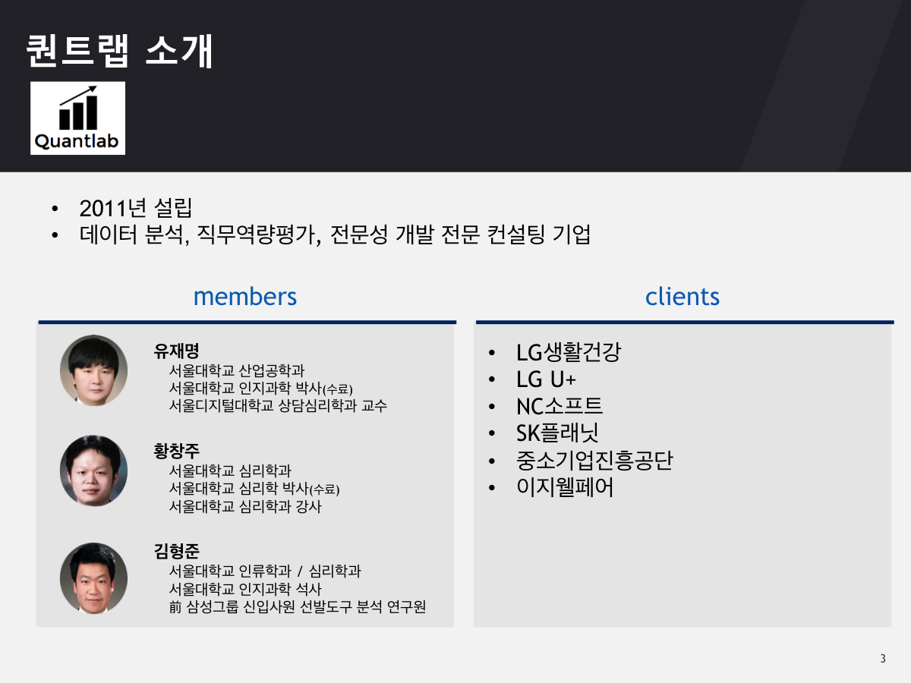

<center></center>

--- .new-background

## 워크숍 관련 온라인 사이트

http://course.mindscale.kr/course/text-analysis

<left></left>

--- .new-background


## 영화 자료를 이용한 다양한 분석

<h3>Topics</h3>
* 주제(topic) 분류 - Text & Self-Rating   
* 개인별 영화 추천 - Text & Self-Rating   
* <font color="red">감정 분석 - Text </font> & Self-Rating

<h3> Method </h3>
* <font color="red"> Visualization</font>  
* Prediction  

<h3> Model </h3>
* Lasso LM / LSA / LDA / Deep Learning  

--- &twocol w1:50% w2:50% .new-background

## 분석 예시 - Text

*** =left
<center></center>

*** =right
<center></center>

--- .new-background

## 분석 예시 - Self-Rating

<center></center>

--- .new-background

## 분석 예시 - Self-Rating & Text

<center></center>

--- &twocol w1:40% w2:60% .new-background

## Think!!

*** =left
<h4><br></h4>

*** =right
<center></center>

--- &twocol w1:40% w2:60% .new-background

## 목차

*** =left
<h4><br></h4>
<h3 style="text-align:left">1. R 기초 세팅</h3>
<h3 style="text-align:left">2. 패키지 인스톨</h3>    
<h3 style="text-align:left">3. 어벤져스 웹크롤</h3>  
<h3 style="text-align:left">4. 키워드 파싱 및 추출</h3>  
<h3 style="text-align:left">5. Co-occurrence Matrix</h3>  
<h3 style="text-align:left">6. 감정사전 불러오기</h3>  
<h3 style="text-align:left">7. 시각화</h3>  

*** =right
<center></center>

--- .new-background

<center></center>

--- .dark .segue .nobackground

## 1. R 기초 세팅

--- .new-background

## 1. R 기초 세팅

<h3b><font color="blue"><b> 학습 목표 </b></font></h3b>  
<h3b> - R에서 작업 디렉토리 설정하기</h3b>  
<h3b> - MAC의 경우 그래픽 설정하기</h3b>

--- .new-background

## 1. R 기초 세팅

### Session -> Set Working Directory -> Choose Directory

- MAC

```{r, eval=T}
par(family="AppleGothic")  ##  그림 출력시 한글폰트
```

```

--- .dark .segue .nobackground
## 2. 패키지 인스톨

--- .new-background

## 2. 패키지 인스톨

<h3b><font color="blue"><b> 학습 목표 </b></font></h3b>  
<h3b> - 패키지 인스톨</h3b>  
<h3b> - 패키지 불러오기</h3b>

--- .new-background .modal

## 2. 패키지 인스톨

<h4></br></h4>
<h4></br></h4>

<h4>영화 웹크롤 및 파싱</h4>
* [rvest](http://cran.r-project.org/web/packages/rvest/index.html)  
* [stringr](http://cran.r-project.org/web/packages/stringr/index.html)  

<h4></br></h4>
<h4></br></h4>

<h4>감정 사전 </h4>
<!-- * [readxl](http://cran.r-project.org/web/packages/readxl/index.html)  -->
* [한국어 감정 사전 1](http://word.snu.ac.kr/kosac/)  
* [한국어 감정 사전 2](http://clab.snu.ac.kr/arssa/doku.php?id=app_dict_1.0)  
* [참고 논문 모음 1](http://word.snu.ac.kr/kosac/publications.php)  
* [참고 논문 모음 2](http://clab.snu.ac.kr/arssa/doku.php?id=my_works)  

--- .new-background

## 2. 패키지 인스톨

<h4></br></h4>
<h4></br></h4>

<h4>텍스트 분석</h4>
* [dplyr](http://cran.r-project.org/web/packages/dplyr/index.html)  
* [KoNLP](http://cran.r-project.org/web/packages/KoNLP/index.html)  
* [tm](http://cran.r-project.org/web/packages/tm/index.html)  

<h4></br></h4>
<h4></br></h4>

<h4>네트워크 그래프</h4>
* [qgraph](http://cran.r-project.org/web/packages/qgraph/index.html)  

--- .new-background

## 2. 패키지 인스톨

```{r, eval=F}
install.packages(c("rvest","stringr","dplyr","tm","qgraph", "KoNLP"),
                 repos="http://cran.nexr.com")
```

<h4><br></h4>
<h9>패키지 불러오기</h9>

```{r, eval=T, message=FALSE}
library(httr)
library(rvest)
library(stringr)
library(plyr)
library(tm)
library(qgraph)
library(KoNLP)
```

--- .dark .segue .nobackground

## 3. 어벤져스 웹크롤

--- .new-background

## 3. 어벤져스 웹크롤

<h3b><font color="blue"><b> 학습 목표 </b></font></h3b>  
<!--<h3b> - 웹사이트 배경지식</h3b>  -->
<!-- <h3b> - Regualr Expression (REGEX)</h3b> -->
<h3b> - 단일 페이지 웹크롤</h3b>  
<h3b> - 복수 페이지 웹크롤</h3b>  

--- .new-background

## 다음 영화

http://movie.daum.net

<left></left>

--- .new-background

## 소스코드

<left></left>

--- .new-background

## 요소점검

<left></left>

--- .new-background .modal

## 어벤져스 (1 페이지 웹크롤)

```{r, echo=T, eval=T, results='asis'}
url <- "http://movie.daum.net/moviedetail/moviedetailNetizenPoint.do?movieId=73750&searchType=all&type=after&page=1"
htxt <- html(url)
```

--- .new-background .modal

## 어벤져스 (1 페이지 웹크롤)

```{r, echo=F, eval=T, cache=F}
library("rvest")
url <- "http://movie.daum.net/moviedetail/moviedetailNetizenPoint.do?movieId=73750&searchType=all&type=after&page=1"
htxt <- html(url)
```

```{r}
review <- html_nodes(htxt, "span.comment.article")
review
```

--- .new-background

## 어벤져스 (1 페이지 웹크롤)

```{r, echo=T, results='asis', include=T}
review <- html_nodes(review, "a")
review
```

--- .new-background 

## 어벤져스 (1 페이지 웹크롤)

```{r, echo=T, results='asis', include=T}
review <- html_text(review)
review
```

--- .new-background

## 어벤져스 (1 페이지 웹크롤)

```{r}
url <- "http://movie.daum.net/moviedetail/moviedetailNetizenPoint.do?movieId=73750&searchType=all&type=after&page=1"
htxt <- html(url)
review <- html_nodes(htxt, "span.comment.article")
review <- html_nodes(review, "a")
review <- html_text(review)
length(review)
```

--- .new-background .modal

## 어벤져스 전체 페이지 웹크롤

```{r, eval=F}

all.reviews <- c()

for (page_num in 1:1000)
{
urls_view <- 
paste("http://movie.daum.net/moviedetail/moviedetailNetizenPoint.do?movieId=73750&searchType=all&type=after&page=",
page_num,sep="")
htxt <- html(urls_view)

review <-  html_nodes(htxt, "span.comment.article")
review <-  html_nodes(review, "a")
review <-  html_text(review)

if(length(review)==0) break;

all.reviews <- c(all.reviews, review)
print(paste(page_num, "-th page", sep=""))    
}

```

--- .dark .segue .nobackground

## 4. 키워드 파싱 및 추출

--- .new-background

## 4. 키워드 파싱 및 추출

<h3b><font color="blue"><b> 학습 목표 </b></font></h3b>  

<h3b> - R에서 자연어 처리 문제</h3b>  

<h3b> - 키워드 추출 방법 I (KoNLP - ExtracNoun)</h3b>

<h3b> - 키워드 추출 방법 II (KoNLP - POStagging)</h3b>  

<!-- <h3b> - 키워드 추출 방법 III (앞 두 글자 자르기) - APPENDIX III </h3b> -->

--- .new-background

## R에서 자연어 처리 (KoNLP)

<font color="red">기대</font>했던 것보다 좀 <font color="red">지루</font>했음... 와이프는 
<font color="red">재미있다</font>고...

```{r, eval=T, message=F}
library("KoNLP")
extractNoun("기대했던 것보다 좀 지루했음... 와이프는 재미있다고...")
```

```{r, eval=T, echo=F}
split_12 <- function(x)
{
    str_sub(str_split(x, " ")[[1]],1,2)
}
```

```{r, eval=T, echo=T}
split_12("기대했던 것보다 좀 지루했음... 와이프는 재미있다고...")
```

```{r, eval=T, echo=F}
k <- str_split(paste(sapply(SimplePos09("기대했던 것보다 좀 지루했음... 와이프는 재미있다고..."), function(x) str_extract_all(x,"[가-힣]+/P|[가-힣]+/N")), collapse=" "),
"([ㄱ-ㅎㅏ-ㅢ]|[[:punct:]]|[0-9A-Za-z]|[[:space:]])+")

extractNounVerbAdj <- function(a)
{
    print(k)
}

```

```{r, eval=T, echo=T}
extractNounVerbAdj("기대했던 것보다 좀 지루했음... 와이프는 재미있다고...")
```

--- .dark .segue .nobackground

## 5. Co-occurrence Matrix

--- .new-background

## 5. Co-occurrence Matrix

<h3b><font color="blue"><b> 학습 목표 </b></font></h3b>  
<h3b> - Term x Document Matrix</h3b>  
<h3b> - Co-occurrence Matrix</h3b>

--- .new-background

## Term x Document Matrix

* 행(row)은 Term(단어들), 열(col)은 Document(개인들)로 이루어진 Matrix
* 단어에 대하여 Weight
* 문서 내 단어에 대하여 Weight 
* 모형에 따라 다양한 방식으로 처리

```{r, message=F}
library(tm)
library(KoNLP)
library(plyr)
```

--- .new-background

```{r, eval=T, include=T}
ko.words <- function(doc){
  d <- as.character(doc)
  keyword <- extractNoun(d)
  keyword <- revalue(keyword, c("재밌" = "재미",
                                "재밋" = "재미",
                                "잼있" = "재미",
                                "영화" = "어벤져스"),
                     warn_missing = F)
  keyword
}
```

--- .new-background

## Term x Document Matrix

```{r, include=FALSE}
knitr::opts_chunk$set(cache=TRUE)
```

```{r, echo=F, cache=F}
user.path = "/Users/kimhyungjun/Dropbox/repo/daum_movie/mac"
all.reviews <- read.csv(paste(user.path,"/avengers_text_mac.csv",sep=""), 
                        header = T, 
                        stringsAsFactors = F)
all.reviews <- all.reviews[[1]]
```

```{r, include=T}
cps <- Corpus(VectorSource(all.reviews))
```

--- .new-background

## Term x Document Matrix

```{r, include=FALSE}
knitr::opts_chunk$set(cache=TRUE)
```

```{r, eval=T, warning=F, include=T }
options(mc.cores=1)
tdm <- TermDocumentMatrix(cps,
                          control=list(
                          tokenize=ko.words,
                          weighting=weightBin))
```

--- .new-background .modal

## Term x Document Matrix

```{r, eval=T}
rownames(tdm)[rownames(tdm)=="어벤져스"]
rownames(tdm)[rownames(tdm)=="헐크"]
rownames(tdm)[rownames(tdm)=="등등"]
rownames(tdm)[rownames(tdm)=="ㅡ.ㅡ"]
```

--- .new-background

## Term x Document Matrix

```{r, eval=F}

?TermDocumentMatrix
?TermFreq
```

--- .new-background

## Term x Document Matrix

```{r, include=FALSE}
knitr::opts_chunk$set(cache=TRUE)
```


```{r, eval=T, warning=F, include=T}
options(mc.cores=1)
tdm <- TermDocumentMatrix(cps,
                          control=list(
                          tokenize=ko.words,    
                          wordLengths=c(2,Inf),
                          weighting=weightBin))
```

--- .new-background .modal

## Term x Document Matrix

```{r, eval=T}
rownames(tdm)[rownames(tdm)=="어벤져스"]
rownames(tdm)[rownames(tdm)=="헐크"]
rownames(tdm)[rownames(tdm)=="등등"]
rownames(tdm)[rownames(tdm)=="ㅡ.ㅡ"]
```

--- .new-background

## Term x Document Matrix

```{r, eval=T, warning=F, include=T}
options(mc.cores=1)
tdm <- TermDocumentMatrix(cps,
                          control=list(
                          tokenize=ko.words,    
                          wordLengths=c(2,Inf),
                          weighting=weightBin,
                          removePunctuation=T))
```

--- .new-background .modal

## Term x Document Matrix

```{r, eval=T}
rownames(tdm)[rownames(tdm)=="어벤져스"]
rownames(tdm)[rownames(tdm)=="헐크"]
rownames(tdm)[rownames(tdm)=="등등"]
rownames(tdm)[rownames(tdm)=="ㅡ.ㅡ"]
```

--- .new-background

## 불필요 단어제거

```{r, eval=T}
stopwords()
```

--- .new-background

## Term x Document Matrix

* 해석이 힘든 단어들을 Term x Document Matrix 생성 시 제거

```{r, eval=T}
delete.dict <- c("그냥", "등등", "중간")
```

--- .new-background

## Term x Document Matrix

```{r, eval=T, warning=F, include=T}
options(mc.cores=1)
tdm <- TermDocumentMatrix(cps,
                          control=list(
                          tokenize=ko.words, 
                          wordLengths=c(2,Inf),
                          weighting=weightBin,
                          removePunctuation=T,
                          stopwords=delete.dict))
```

--- .new-background .modal

## Term x Document Matrix

```{r, eval=T}
rownames(tdm)[rownames(tdm)=="어벤져스"]
rownames(tdm)[rownames(tdm)=="헐크"]
rownames(tdm)[rownames(tdm)=="등등"]
rownames(tdm)[rownames(tdm)=="ㅡ.ㅡ"]
```

--- .new-background

## Term x Document Matrix

* 행(row)은 Term(단어들), 열(col)은 Document(개인들)로 이루어진 Matrix

```{r, eval=T, echo=F}
ex <- matrix(c(1,1,1,0, 1,0,1,0, 0,1,0,1), nrow=4)
rownames(ex) <- c("아이폰", "갤럭시", "좋다", "나쁘다")
colnames(ex) <- c("사람1", "사람2", "사람3")
```

```{r}
ex
```

--- .new-background

## Co-occurrence Matrix

* 특정 단어와 다른 단어가 동시에 영화평 내에서 발생한 것을 Counts
* 예시)

```{r, eval=T}
ex %*% t(ex)
```

--- .new-background .modal

## Co-occurrence Matrix

```{r, eval=T, echo=F, warning=F}
options(mc.cores=1)
tdm <- TermDocumentMatrix(cps,
                          control=list(
                          tokenize=ko.words, 
                          wordLengths=c(2,Inf),
                          weighting=weightBin,
                          removePunctuation=T,
                          stopwords=delete.dict))
```


```{r, eval=T}
tdm.m <- as.matrix(tdm)
order(rowSums(tdm.m), decreasing = T)[1:5]
tdm.m <- tdm.m[order(rowSums(tdm.m), decreasing = T),]
```

--- .new-background

## Co-occurrence Matrix

```{r, eval=T}
tdm.m <- tdm.m[1:20, ]
co.mat <- tdm.m %*% t(tdm.m)
co.mat[1:5,1:5]
```

--- .dark .segue .nobackground

## 6. 감정사전 불러오기

--- .new-background

## 6. 감정사전 불러오기

<h3b><font color="blue"><b> 학습 목표 </b></font></h3b>  
<h3b> - 파일 불러오기(read.csv)</h3b>  
<h3b> - 긍정 사전과 부정 사전으로 분할(subset)</h3b>

--- .new-background

## 6. 감정사전 불러오기

```{r, eval=T, echo=F, cache=F}
user.path = "/Users/kimhyungjun/Dropbox/repo/daum_movie/mac"
emotion.dict <- read.csv(paste(user.path,"/emotion_dict_mac.csv", sep=""),
                         header = T, 
                         stringsAsFactors = F)
```

```{r, eval=F}
emotion.dict <- read.csv("emotion_dict_mac.csv", 
                         header = T, 
                         stringsAsFactors = F)
```

```{r, eval=T, include=T, cache=F}
pos.word <- subset(emotion.dict, pos_neg=="pos")[,"words"]
neg.word <- subset(emotion.dict, pos_neg=="neg")[,"words"]
#emotion.dict[11:15,]; emotion.dict[1301:1305,];
```

<h4><br></h4>
[감정사전](https://www.dropbox.com/s/okv4mjiq0wlhgbl/emotion_dict_mac.csv?dl=0)

--- .new-background .modal

## Term x Document Matrix와 감정 사전

```{r, echo=F}
user.path <- "/Users/kimhyungjun/Dropbox/repo/daum_movie/mac"
emotion.dict <- read.csv(paste(user.path,"/emotion_dict_mac.csv", sep=""),
                         header = T, 
                         stringsAsFactors = F)
pos.word <- subset(emotion.dict, pos_neg=="pos")[,"words"]
neg.word <- subset(emotion.dict, pos_neg=="neg")[,"words"]
```

```{r, cache=F}
rownames(co.mat)[rownames(co.mat) %in% neg.word]
rownames(co.mat)[rownames(co.mat) %in% pos.word]

groups.list = list()
groups.list$비호감단어 <- which(rownames(co.mat) %in% neg.word)
groups.list$호감단어 <- which(rownames(co.mat) %in% pos.word)
groups.list
```

--- .dark .segue .nobackground

## 7. 시각화

--- .new-background

## 7. 시각화

<h3b><font color="blue"><b> 학습 목표 </b></font></h3b>  
<h3b> - Graph 그리기(qgraph)</h3b>  

--- .new-background

## Graph

```{r, message=F}
library("qgraph")
```

```{r, eval=F}
qgraph(co.mat, labels = rownames(co.mat), diag=F)
```

--- .new-background

<center></center>

--- .new-background

```{r, eval=F}
qgraph(co.mat, labels = rownames(co.mat), diag=F,
       layout="spring")
```

--- .new-background

<center></center>

--- .new-background


```{r, eval=F}
qgraph(co.mat, labels = rownames(co.mat), diag=F,
       layout="spring", 
       edge.color = "darkblue")
```

--- .new-background

<center></center>

--- .new-background

```{r, eval=F}
qgraph(co.mat, labels = rownames(co.mat), diag=F,
       layout="spring", 
       edge.color = "darkblue",
       groups = groups.list)
```

--- .new-background

<center></center>

--- .new-background

```{r, eval=F}
qgraph(co.mat, labels = rownames(co.mat), diag=F,
       layout = "spring", 
       edge.color = "darkblue",
       groups = groups.list,
       vsize = 5,
       legend.cex = .7)
      
title(movie_name, line = 3)
```

--- .new-background

<center></center>

--- .new-background

```{r, eval=F}

qgraph(co.mat, labels = rownames(co.mat), diag=F,
       layout = "spring", 
       edge.color = "darkblue",
       groups = groups.list,
       vsize = log(diag(co.mat)),
       legend.cex = .7)

title(movie_name, line = 3)

```

--- .new-background

<center></center>

--- .new-background

```{r, eval=F}

qgraph(co.mat, labels = rownames(co.mat), diag=F,
       layout = "spring", 
       edge.color = "darkblue",
       groups = groups.list,
       vsize = log(diag(co.mat)),
       legend.cex = .7,
       color=c("gold", "lightblue"))

```

--- .new-background

[Tips](https://www.nceas.ucsb.edu/~frazier/RSpatialGuides/colorPaletteCheatsheet.pdf)

<center></center>

--- .new-background

## 의문 단어 찾아보기(상관관계)

```{r, eval=T}
head(findAssocs(tdm, "서울", 0))
```

--- .new-background

## 의문 단어 찾아보기(상관관계)

```{r, eval=T}
head(findAssocs(tdm, "다음", 0))
```

--- .new-background

<div align="center">
<iframe width="100%" height="300"
src="http://soeque1.github.io/r_slide/daum_crawling/html/graph.html" allowfullscreen>
    </iframe></div>

--- .dark .segue .nobackground

## 감사합니다
