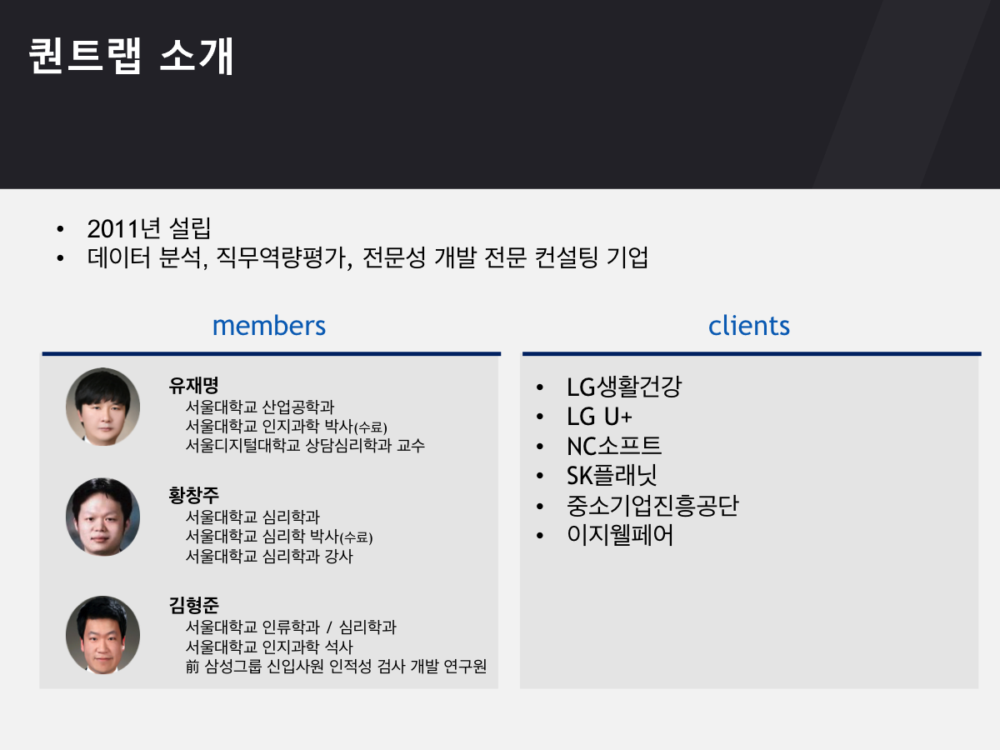
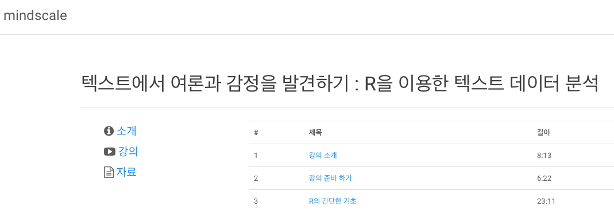
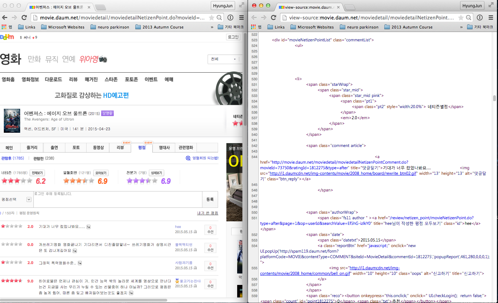
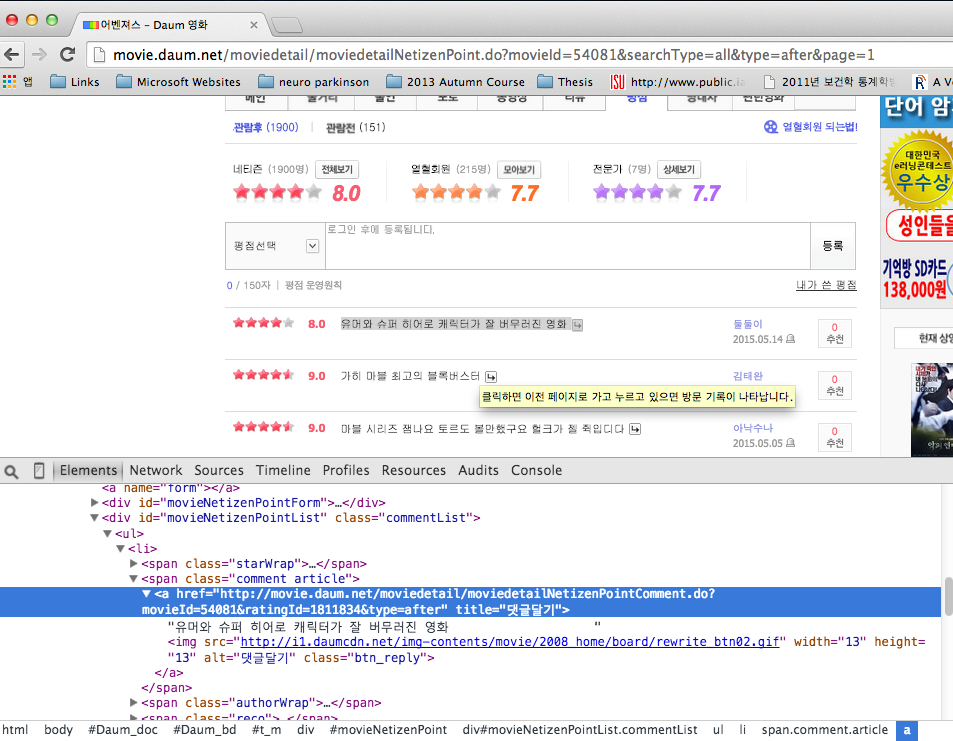
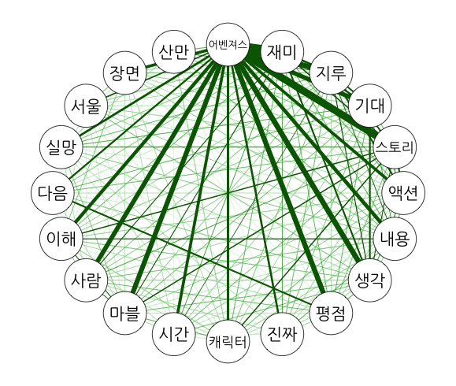
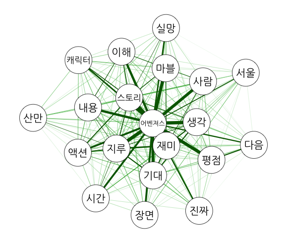
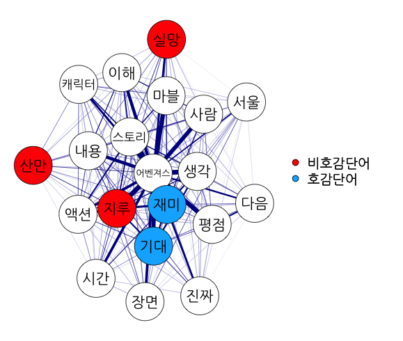
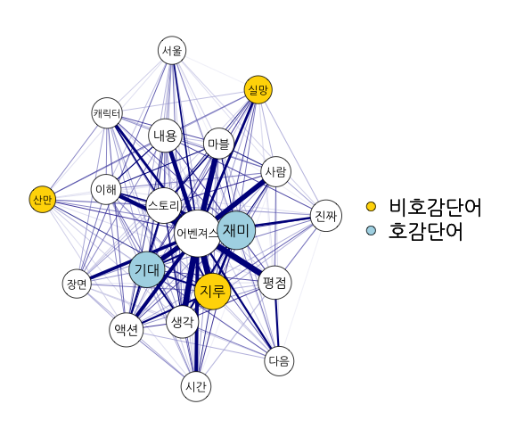

<center></center>

--- .new-background

## 워크숍 관련 온라인 사이트

http://course.mindscale.kr/course/text-analysis

<left></left>

--- .new-background


## 영화 자료를 이용한 다양한 분석

<h3>Topics</h3>
* 주제(topic) 분류 - Text & Self-Rating   
* 개인별 영화 추천 - Text & Self-Rating   
* <font color="red">감정 분석 - Text </font> & Self-Rating

<h3> Method </h3>
* <font color="red"> Visualization</font>  
* Prediction  

<h3> Model </h3>
* Lasso LM / LSA / LDA / Deep Learning  

--- &twocol w1:50% w2:50% .new-background

## 분석 예시 - Text

*** =left
<center></center>

*** =right
<center></center>

--- .new-background

## 분석 예시 - Self-Rating

<center></center>

--- .new-background

## 분석 예시 - Self-Rating & Text

<center></center>

--- .new-background

## 목차

<h4><br></h4>
<h3 style="text-align:left">1. R 기초 세팅</h3>
<h3 style="text-align:left">2. 패키지 인스톨</h3>    
<h3 style="text-align:left">3. 어벤져스 웹크롤</h3>  
<h3 style="text-align:left">4. 웹크롤 연습</h3>  
<h3 style="text-align:left">5. 감정사전 불러오기</h3>  
<h3 style="text-align:left">6. Co-occurrence Matrix</h3>  
<h3 style="text-align:left">7. 시각화</h3>  

--- &twocol w1:40% w2:60% .new-background

## 목차

*** =left
<h4><br></h4>
<h3 style="text-align:left">1. R 기초 세팅</h3>
<h3 style="text-align:left">2. 패키지 인스톨</h3>    
<h3 style="text-align:left">3. 어벤져스 웹크롤</h3>  
<h3 style="text-align:left">4. 웹크롤 연습</h3>  
<h3 style="text-align:left">5. 감정사전 불러오기</h3>  
<h3 style="text-align:left">6. Co-occurrence Matrix</h3>  
<h3 style="text-align:left">7. 시각화</h3>  

*** =right
<center></center>
---

--- .new-background

<center></center>

--- .dark .segue .nobackground

## 1. R 기초 세팅

--- .new-background

## 1. R 기초 세팅

<h3b><font color="blue"><b> 학습 목표 </b></font></h3b>  
<h3b> - R에서 작업 디렉토리 설정하기</h3b>  
<h3b> - MAC의 경우 그래픽 설정하기</h3b>

--- .new-background

## 1. R 기초 세팅

### Session -> Set Working Directory -> To Source File Location

- MAC


```r
par(family="AppleGothic")  ##  그림 출력시 한글폰트
```

```

--- .dark .segue .nobackground
## 2. 패키지 인스톨

--- .new-background

## 2. 패키지 인스톨

<h3b><font color="blue"><b> 학습 목표 </b></font></h3b>  
<h3b> - 패키지 인스톨</h3b>  
<h3b> - 패키지 불러오기</h3b>

--- .new-background .modal

## 2. 패키지 인스톨

<h4></br></h4>
<h4></br></h4>

<h4>영화 웹크롤 및 파싱</h4>
* [rvest](http://cran.r-project.org/web/packages/rvest/index.html)  
* [stringr](http://cran.r-project.org/web/packages/stringr/index.html)  

<h4></br></h4>
<h4></br></h4>

<h4>감정 사전 </h4>
<!-- * [readxl](http://cran.r-project.org/web/packages/readxl/index.html)  -->
* [한국어 감정 사전 1](http://word.snu.ac.kr/kosac/)  
* [한국어 감정 사전 2](http://clab.snu.ac.kr/arssa/doku.php?id=app_dict_1.0)  
* [참고 논문 모음 1](http://word.snu.ac.kr/kosac/publications.php)  
* [참고 논문 모음 2](http://clab.snu.ac.kr/arssa/doku.php?id=my_works)  

--- .new-background

## 2. 패키지 인스톨

<h4></br></h4>
<h4></br></h4>

<h4>텍스트 분석</h4>
* [dplyr](http://cran.r-project.org/web/packages/dplyr/index.html)  
* [KoNLP](http://cran.r-project.org/web/packages/KoNLP/index.html)  
* [tm](http://cran.r-project.org/web/packages/tm/index.html)  

<h4></br></h4>
<h4></br></h4>

<h4>네트워크 그래프</h4>
* [qgraph](http://cran.r-project.org/web/packages/qgraph/index.html)  

--- .new-background

## 2. 패키지 인스톨


```r
install.packages(c("rvest","stringr","dplyr","tm","qgraph", "KoNLP"),
                 repos="http://cran.nexr.com")
```

<h4><br></h4>
<h9>패키지 불러오기</h9>


```r
library(httr)
library(rvest)
library(stringr)
library(plyr)
library(tm)
library(qgraph)
library(KoNLP)
```

--- .dark .segue .nobackground

## 3. 어벤져스 웹크롤

--- .new-background

## 3. 어벤져스 웹크롤

<h3b><font color="blue"><b> 학습 목표 </b></font></h3b>  
<!--<h3b> - 웹사이트 배경지식</h3b>  -->
<!-- <h3b> - Regualr Expression (REGEX)</h3b> -->
<h3b> - 단일 페이지 웹크롤</h3b>  
<h3b> - 복수 페이지 웹크롤</h3b>  

--- .new-background

## 다음 영화

http://movie.daum.net

<left></left>

--- .new-background

## 소스코드

<left></left>

--- .new-background

## 요소점검

<left></left>

--- .new-background .modal

## 어벤져스 (1 페이지 웹크롤)


```r
url<- "http://movie.daum.net/moviedetail/moviedetailNetizenPoint.do?movieId=73750&searchType=all&type=after&page=1"
htxt <- html(url)
```

--- .new-background .modal

## 어벤져스 (1 페이지 웹크롤)


```r
review <- html_nodes(htxt, "span.comment.article")
review
```

```
## [[1]]
## <span class="comment article">
## 					
## 										<a href="http://movie.daum.net/moviedetail/moviedetailNetizenPointComment.do?movieId=73750&amp;ratingId=1818943&amp;type=after" title="댓글달기"> 나름 괜찬았는데 뭐.. 그나저나, 마지막에 인피니티 건틀렛 타노스.,, 3에서 저거 무슨 억지로 잡을라고... 은하계 쉽게 파괴하는 애한테 무슨,, 룬킹토르라도 나올거냐.. 마블 좀 알고 있는 사람들이라면 인건 타노스 잡는거는 불가능하다는거는 알텐데..                    </a>
## 
## 					</span> 
## 
## [[2]]
## <span class="comment article">
## 					
## 										<a href="http://movie.daum.net/moviedetail/moviedetailNetizenPointComment.do?movieId=73750&amp;ratingId=1818928&amp;type=after" title="댓글달기">1편보다 나은2편은없다
## 천만이아깝다                    </a>
## 
## 					</span> 
## 
## [[3]]
## <span class="comment article">
## 					
## 										<a href="http://movie.daum.net/moviedetail/moviedetailNetizenPointComment.do?movieId=73750&amp;ratingId=1818913&amp;type=after" title="댓글달기">1편에서 밑밥을 많이 깔길래 2편은 전개를 할 줄 알았는데 2편에서도 또 중얼중얼.. 감독 바뀔 때마다 캐릭터 설정에 상영시간 할애 할건가? 잡다하게 드라마 넣을 시간은 있어도 왜 울트론을 만들어야 하는지에 대한 개연성을 살려줄 로키분량은 왜 삭제했는지 모르겠다.                     <span class="em b">[1]</span>
##                     </a>
## 
## 					</span> 
## 
## [[4]]
## <span class="comment article">
## 					
## 										<a href="http://movie.daum.net/moviedetail/moviedetailNetizenPointComment.do?movieId=73750&amp;ratingId=1818884&amp;type=after" title="댓글달기">어벤져스는 끝났다. 희망은 없다!......
## 
## 
## 라고 포스터 밑에 적혀있는 카피가 영화의 운명을 말해주는 듯...                    </a>
## 
## 					</span> 
## 
## [[5]]
## <span class="comment article">
## 					
## 										<a href="http://movie.daum.net/moviedetail/moviedetailNetizenPointComment.do?movieId=73750&amp;ratingId=1818878&amp;type=after" title="댓글달기">사공이 많아서 배가 산으로 간 느낌??                    </a>
## 
## 					</span> 
## 
## [[6]]
## <span class="comment article">
## 					
## 										<a href="http://movie.daum.net/moviedetail/moviedetailNetizenPointComment.do?movieId=73750&amp;ratingId=1818711&amp;type=after" title="댓글달기">흠...평점이 이해가 잘 안되네...액션 히어로물이라는 관점에서 보면 충분히 잘만들어진 액션오락영화가 맞음...난 평가라는건 상대적인 개념으로 봐야한다고 생각하는데...유일한 단점이라면 개별히어로 작품들을 안보면 이해가 어려운 부분이 많다는거...그거 감안해서 8점 드림                    </a>
## 
## 					</span> 
## 
## [[7]]
## <span class="comment article">
## 					
## 										<a href="http://movie.daum.net/moviedetail/moviedetailNetizenPointComment.do?movieId=73750&amp;ratingId=1818556&amp;type=after" title="댓글달기">&lt;솔직 평점&gt; 역시 마블은 기대에 부흥하는 영화를 만듭니다. 그러나 1편에비해 박진감이전혀없는 전투씬들은 아쉬움으로 남았습니다.                    </a>
## 
## 					</span> 
## 
## [[8]]
## <span class="comment article">
## 					
## 										<a href="http://movie.daum.net/moviedetail/moviedetailNetizenPointComment.do?movieId=73750&amp;ratingId=1817876&amp;type=after" title="댓글달기">이런거 왜 만들었죠? 딱 봐도 10점 드릴께 뻔한데 ㅋㅋ 중간에 심심하지 않게 유머감도 있고 등장인물을 널리 알리기에도 좋은것 같아요 ㅎ 어벤져스 등장인물들 사랑해요♥♡                    </a>
## 
## 					</span> 
## 
## [[9]]
## <span class="comment article">
## 					
## 										<a href="http://movie.daum.net/moviedetail/moviedetailNetizenPointComment.do?movieId=73750&amp;ratingId=1817875&amp;type=after" title="댓글달기">ㅎㅎㅎㅎㅎㅎㅎ보고나서 "역시 마블은 다르구나."라고 생각 들었습니다 ㅎㅎ 너무 만족했습니다 ㅎㅎ 평점 10보다 더 드리고 싶은뎅...ㅎㅎ                    </a>
## 
## 					</span> 
## 
## [[10]]
## <span class="comment article">
## 					
## 										<a href="http://movie.daum.net/moviedetail/moviedetailNetizenPointComment.do?movieId=73750&amp;ratingId=1817874&amp;type=after" title="댓글달기">너무나 재밌었던 최고적인 영화입니다~~ㅎㅎ                    </a>
## 
## 					</span> 
## 
## [[11]]
## <span class="comment article">
## 					
## 										<a href="http://movie.daum.net/moviedetail/moviedetailNetizenPointComment.do?movieId=73750&amp;ratingId=1817872&amp;type=after" title="댓글달기">마블 시리즈는 항상 볼거리 하나로 대만족 ㅎㅎ                    </a>
## 
## 					</span> 
## 
## [[12]]
## <span class="comment article">
## 					
## 										<a href="http://movie.daum.net/moviedetail/moviedetailNetizenPointComment.do?movieId=73750&amp;ratingId=1817853&amp;type=after" title="댓글달기">이제 거품 다 빠졌다... 0점이나 드삼~                    </a>
## 
## 					</span> 
## 
## [[13]]
## <span class="comment article">
## 					
## 										<a href="http://movie.daum.net/moviedetail/moviedetailNetizenPointComment.do?movieId=73750&amp;ratingId=1817852&amp;type=after" title="댓글달기">1편보다는 훨 나았지만 역시 히어로물은 저하곤 맞질 않네요..뭐, 액션도, CG도 그리 인상 깊지 않았구요, 황진미 평론가 말처럼 그냥 잡탕밥 같아요.. 6.1                    </a>
## 
## 					</span> 
## 
## [[14]]
## <span class="comment article">
## 					
## 										<a href="http://movie.daum.net/moviedetail/moviedetailNetizenPointComment.do?movieId=73750&amp;ratingId=1817794&amp;type=after" title="댓글달기">아마 원작 마블처럼 얘기를 똑같이 따라 했다면 이미 다 아는 스토리 누가 큰 기대감을 가지고 봤을까 SF라 하면 어벤져스2를 위한 장르 아닌가 싶을정도로 재밌었어요 간간히 개그멘트도 좋았구요 아주 재밌고 좋았습니다.                    </a>
## 
## 					</span> 
## 
## [[15]]
## <span class="comment article">
## 					
## 										<a href="http://movie.daum.net/moviedetail/moviedetailNetizenPointComment.do?movieId=73750&amp;ratingId=1817423&amp;type=after" title="댓글달기">마블 시네마틱 유니버스를 대강만이라도 알고 있다면 재밌겠지만&#13;
## 그렇지 않다면 너무도 불친절한 영화인듯..                    </a>
## 
## 					</span> 
## 
## attr(,"class")
## [1] "XMLNodeSet"
```

--- .new-background

## 어벤져스 (1 페이지 웹크롤)


```r
review <- html_nodes(review, "a")
review
```

[[1]]
<a href="http://movie.daum.net/moviedetail/moviedetailNetizenPointComment.do?movieId=73750&amp;ratingId=1818943&amp;type=after" title="댓글달기"> 나름 괜찬았는데 뭐.. 그나저나, 마지막에 인피니티 건틀렛 타노스.,, 3에서 저거 무슨 억지로 잡을라고... 은하계 쉽게 파괴하는 애한테 무슨,, 룬킹토르라도 나올거냐.. 마블 좀 알고 있는 사람들이라면 인건 타노스 잡는거는 불가능하다는거는 알텐데..                    </a> 

[[2]]
<a href="http://movie.daum.net/moviedetail/moviedetailNetizenPointComment.do?movieId=73750&amp;ratingId=1818928&amp;type=after" title="댓글달기">1편보다 나은2편은없다
천만이아깝다                    </a> 

[[3]]
<a href="http://movie.daum.net/moviedetail/moviedetailNetizenPointComment.do?movieId=73750&amp;ratingId=1818913&amp;type=after" title="댓글달기">1편에서 밑밥을 많이 깔길래 2편은 전개를 할 줄 알았는데 2편에서도 또 중얼중얼.. 감독 바뀔 때마다 캐릭터 설정에 상영시간 할애 할건가? 잡다하게 드라마 넣을 시간은 있어도 왜 울트론을 만들어야 하는지에 대한 개연성을 살려줄 로키분량은 왜 삭제했는지 모르겠다.                     <span class="em b">[1]</span>
                    </a> 

[[4]]
<a href="http://movie.daum.net/moviedetail/moviedetailNetizenPointComment.do?movieId=73750&amp;ratingId=1818884&amp;type=after" title="댓글달기">어벤져스는 끝났다. 희망은 없다!......


라고 포스터 밑에 적혀있는 카피가 영화의 운명을 말해주는 듯...                    </a> 

[[5]]
<a href="http://movie.daum.net/moviedetail/moviedetailNetizenPointComment.do?movieId=73750&amp;ratingId=1818878&amp;type=after" title="댓글달기">사공이 많아서 배가 산으로 간 느낌??                    </a> 

[[6]]
<a href="http://movie.daum.net/moviedetail/moviedetailNetizenPointComment.do?movieId=73750&amp;ratingId=1818711&amp;type=after" title="댓글달기">흠...평점이 이해가 잘 안되네...액션 히어로물이라는 관점에서 보면 충분히 잘만들어진 액션오락영화가 맞음...난 평가라는건 상대적인 개념으로 봐야한다고 생각하는데...유일한 단점이라면 개별히어로 작품들을 안보면 이해가 어려운 부분이 많다는거...그거 감안해서 8점 드림                    </a> 

[[7]]
<a href="http://movie.daum.net/moviedetail/moviedetailNetizenPointComment.do?movieId=73750&amp;ratingId=1818556&amp;type=after" title="댓글달기">&lt;솔직 평점&gt; 역시 마블은 기대에 부흥하는 영화를 만듭니다. 그러나 1편에비해 박진감이전혀없는 전투씬들은 아쉬움으로 남았습니다.                    </a> 

[[8]]
<a href="http://movie.daum.net/moviedetail/moviedetailNetizenPointComment.do?movieId=73750&amp;ratingId=1817876&amp;type=after" title="댓글달기">이런거 왜 만들었죠? 딱 봐도 10점 드릴께 뻔한데 ㅋㅋ 중간에 심심하지 않게 유머감도 있고 등장인물을 널리 알리기에도 좋은것 같아요 ㅎ 어벤져스 등장인물들 사랑해요♥♡                    </a> 

[[9]]
<a href="http://movie.daum.net/moviedetail/moviedetailNetizenPointComment.do?movieId=73750&amp;ratingId=1817875&amp;type=after" title="댓글달기">ㅎㅎㅎㅎㅎㅎㅎ보고나서 "역시 마블은 다르구나."라고 생각 들었습니다 ㅎㅎ 너무 만족했습니다 ㅎㅎ 평점 10보다 더 드리고 싶은뎅...ㅎㅎ                    </a> 

[[10]]
<a href="http://movie.daum.net/moviedetail/moviedetailNetizenPointComment.do?movieId=73750&amp;ratingId=1817874&amp;type=after" title="댓글달기">너무나 재밌었던 최고적인 영화입니다~~ㅎㅎ                    </a> 

[[11]]
<a href="http://movie.daum.net/moviedetail/moviedetailNetizenPointComment.do?movieId=73750&amp;ratingId=1817872&amp;type=after" title="댓글달기">마블 시리즈는 항상 볼거리 하나로 대만족 ㅎㅎ                    </a> 

[[12]]
<a href="http://movie.daum.net/moviedetail/moviedetailNetizenPointComment.do?movieId=73750&amp;ratingId=1817853&amp;type=after" title="댓글달기">이제 거품 다 빠졌다... 0점이나 드삼~                    </a> 

[[13]]
<a href="http://movie.daum.net/moviedetail/moviedetailNetizenPointComment.do?movieId=73750&amp;ratingId=1817852&amp;type=after" title="댓글달기">1편보다는 훨 나았지만 역시 히어로물은 저하곤 맞질 않네요..뭐, 액션도, CG도 그리 인상 깊지 않았구요, 황진미 평론가 말처럼 그냥 잡탕밥 같아요.. 6.1                    </a> 

[[14]]
<a href="http://movie.daum.net/moviedetail/moviedetailNetizenPointComment.do?movieId=73750&amp;ratingId=1817794&amp;type=after" title="댓글달기">아마 원작 마블처럼 얘기를 똑같이 따라 했다면 이미 다 아는 스토리 누가 큰 기대감을 가지고 봤을까 SF라 하면 어벤져스2를 위한 장르 아닌가 싶을정도로 재밌었어요 간간히 개그멘트도 좋았구요 아주 재밌고 좋았습니다.                    </a> 

[[15]]
<a href="http://movie.daum.net/moviedetail/moviedetailNetizenPointComment.do?movieId=73750&amp;ratingId=1817423&amp;type=after" title="댓글달기">마블 시네마틱 유니버스를 대강만이라도 알고 있다면 재밌겠지만&#13;
그렇지 않다면 너무도 불친절한 영화인듯..                    </a> 

attr(,"class")
[1] "XMLNodeSet"

--- .new-background 

## 어벤져스 (1 페이지 웹크롤)


```r
review <- html_text(review)
review
```

 [1] " 나름 괜찬았는데 뭐.. 그나저나, 마지막에 인피니티 건틀렛 타노스.,, 3에서 저거 무슨 억지로 잡을라고... 은하계 쉽게 파괴하는 애한테 무슨,, 룬킹토르라도 나올거냐.. 마블 좀 알고 있는 사람들이라면 인건 타노스 잡는거는 불가능하다는거는 알텐데..                    "                                        
 [2] "1편보다 나은2편은없다\n천만이아깝다                    "                                                                                                                                                                                                                                                   
 [3] "1편에서 밑밥을 많이 깔길래 2편은 전개를 할 줄 알았는데 2편에서도 또 중얼중얼.. 감독 바뀔 때마다 캐릭터 설정에 상영시간 할애 할건가? 잡다하게 드라마 넣을 시간은 있어도 왜 울트론을 만들어야 하는지에 대한 개연성을 살려줄 로키분량은 왜 삭제했는지 모르겠다.                     [1]\n                    "
 [4] "어벤져스는 끝났다. 희망은 없다!......\n\n\n라고 포스터 밑에 적혀있는 카피가 영화의 운명을 말해주는 듯...                    "                                                                                                                                                                              
 [5] "사공이 많아서 배가 산으로 간 느낌??                    "                                                                                                                                                                                                                                                   
 [6] "흠...평점이 이해가 잘 안되네...액션 히어로물이라는 관점에서 보면 충분히 잘만들어진 액션오락영화가 맞음...난 평가라는건 상대적인 개념으로 봐야한다고 생각하는데...유일한 단점이라면 개별히어로 작품들을 안보면 이해가 어려운 부분이 많다는거...그거 감안해서 8점 드림                    "                  
 [7] "<솔직 평점> 역시 마블은 기대에 부흥하는 영화를 만듭니다. 그러나 1편에비해 박진감이전혀없는 전투씬들은 아쉬움으로 남았습니다.                    "                                                                                                                                                          
 [8] "이런거 왜 만들었죠? 딱 봐도 10점 드릴께 뻔한데 ㅋㅋ 중간에 심심하지 않게 유머감도 있고 등장인물을 널리 알리기에도 좋은것 같아요 ㅎ 어벤져스 등장인물들 사랑해요♥♡                    "                                                                                                                     
 [9] "ㅎㅎㅎㅎㅎㅎㅎ보고나서 \"역시 마블은 다르구나.\"라고 생각 들었습니다 ㅎㅎ 너무 만족했습니다 ㅎㅎ 평점 10보다 더 드리고 싶은뎅...ㅎㅎ                    "                                                                                                                                                  
[10] "너무나 재밌었던 최고적인 영화입니다~~ㅎㅎ                    "                                                                                                                                                                                                                                             
[11] "마블 시리즈는 항상 볼거리 하나로 대만족 ㅎㅎ                    "                                                                                                                                                                                                                                          
[12] "이제 거품 다 빠졌다... 0점이나 드삼~                    "                                                                                                                                                                                                                                                  
[13] "1편보다는 훨 나았지만 역시 히어로물은 저하곤 맞질 않네요..뭐, 액션도, CG도 그리 인상 깊지 않았구요, 황진미 평론가 말처럼 그냥 잡탕밥 같아요.. 6.1                    "                                                                                                                                     
[14] "아마 원작 마블처럼 얘기를 똑같이 따라 했다면 이미 다 아는 스토리 누가 큰 기대감을 가지고 봤을까 SF라 하면 어벤져스2를 위한 장르 아닌가 싶을정도로 재밌었어요 간간히 개그멘트도 좋았구요 아주 재밌고 좋았습니다.                    "                                                                       
[15] "마블 시네마틱 유니버스를 대강만이라도 알고 있다면 재밌겠지만\r\n그렇지 않다면 너무도 불친절한 영화인듯..                    "                                                                                                                                                                              

--- .new-background

## 어벤져스 (1 페이지 웹크롤)


```r
url <- "http://movie.daum.net/moviedetail/moviedetailNetizenPoint.do?movieId=73750&searchType=all&type=after&page=1"
htxt <- html(url)
review <- html_nodes(htxt, "span.comment.article")
review <- html_nodes(review, "a")
review <- html_text(review)
length(review)
```

```
## [1] 15
```

--- .new-background .modal

## 어벤져스 전체 페이지 웹크롤


```r
all.reviews <- c()

for (page_num in 1:1000)
{
urls_view <- 
paste("http://movie.daum.net/moviedetail/moviedetailNetizenPoint.do?movieId=73750&searchType=all&type=after&page=",
page_num,sep="")
htxt <- html(urls_view)

review <-  html_nodes(htxt, "span.comment.article")
review <-  html_nodes(review, "a")
review <-  html_text(review)

if(length(review)==0) break;

all.reviews <- c(all.reviews, review)
print(paste(page_num, "-th page", sep=""))    
}
```

--- .dark .segue .nobackground

## 3. 웹크롤 예제 

--- .new-background

## 3. 웹크롤 예제
보배드림 - http://www.bobaedream.co.kr/mycar/mycar_list.php?gubun=K


```r
url<- "http://www.bobaedream.co.kr/mycar/mycar_list.php?gubun=K"
htxt <- html(url)
title <- html_text(html_nodes(htxt, ".title a"))
title <- title[title!="찜"]
price <- html_text(html_nodes(htxt, ".centeralign .redbold02"))
title.price <- cbind(title, price)
title.price
```

```
##       title                                            price  
##  [1,] "현대 마이티2 3.5톤 윙바디 "                     "1,850"
##  [2,] "기아 K5 2.0 LPi 럭셔리"                         "1,090"
##  [3,] "현대 뉴 에쿠스 VS 380 프레스티지 VIP "          "2,490"
##  [4,] "현대 베라크루즈 4WD 300VX 프리미엄"             "2,750"
##  [5,] "현대 그랜져HG 240 럭셔리"                       "2,250"
##  [6,] "기아 뉴 스포티지 TLX 2WD 고급형"                "690"  
##  [7,] "현대 뉴 에쿠스 VS 380(12년) 프레스티지 V.."     "4,090"
##  [8,] "현대 더 럭셔리 그랜져 Q240 디럭스"              "1,090"
##  [9,] "현대 뉴아반떼XD 1.6 VVT 디럭스 기본형"          "350"  
## [10,] "현대 그랜져HG 300 익스큐시브"                   "2,750"
## [11,] "현대 싼타페 더스타일 2.0 e-VGT MLX 2WD "        "1,350"
## [12,] "기아 올 뉴 모닝 스마트 "                        "690"  
## [13,] "현대 그랜져HG 300 로얄"                         "2,450"
## [14,] "현대 그랜져HG 240 모던"                         "2,390"
## [15,] "현대 YF쏘나타 Y20 프리미어 최고급형"            "1,590"
## [16,] "현대 YF쏘나타 Y20 프리미어 "                    "1,550"
## [17,] "쌍용 뉴 체어맨W CW600 SVIP"                     "2,890"
## [18,] "현대 제네시스 BH330 프리미엄 스페셜"            "2,950"
## [19,] "기아 더 프레스티지 K7 3.0 LPi 럭셔리"           "1,490"
## [20,] "현대 i40 살룬 1.7 VGT 디 스팩"                  "3,090"
## [21,] "현대 뉴 에쿠스 VS 500 프레스티지"               "3,790"
## [22,] "현대 뉴 에쿠스 VS 380 프라임"                   "3,590"
## [23,] "현대 제네시스 BH330 프리미엄 스페셜"            "3,290"
## [24,] "현대 뉴 에쿠스 VS 500 프레스티지"               "3,690"
## [25,] "기아 레이 1.0 가솔린 프레스티지"                "890"  
## [26,] "현대 엑센트 (신형) 1.6 GDi 탑"                  "990"  
## [27,] "현대 갤로퍼2 숏바디 이노베이션 밴 터보 엑시드 " "390"  
## [28,] "현대 쏘나타 더 브릴리언트 LPi 스마트"           "790"  
## [29,] "현대 쏘나타 하이브리드 프리미엄 "               "2,080"
## [30,] "현대 뉴 에쿠스 VS380(13년~) 모던"               "4,800"
```

--- .new-background

## 3. 웹크롤 예제

네이트 뉴스 - http://news.nate.com/section?mid=n0200


```r
url <- "http://news.nate.com/section?mid=n0200"
htxt <- html(url)
news_list <- html_attr(html_nodes(htxt,".speechLink .f_clear a"), "href")
html_text(html_nodes(html(news_list[1]), ".mduSubjectContent strong"))
```

```
##  [1] "[속보]공무원연금법 개정안, 국회 본회의 통과"                                                          
##  [2] "'시행령 수정권한' 국회법, 운영위 소위 수정의결 '지체없이' 문구 삭제"                                  
##  [3] "여 \"세월호특별법 시행령 수정 절대 불가\"…청 '심기' 때문?"                                            
##  [4] "공무원연금 개혁안 또 무산 위기…'세월호 조사1과장' 민간에 못 맡기겠다는 여당"                          
##  [5] "서기관 1명 때문에…100만 공무원 연금 하루종일 엎치락뒤치락"                                            
##  [6] "'유승민표 합의안' 또 잡음"                                                                            
##  [7] "정청래 '후폭풍'…조경태 징계에 쏠린 눈"                                                                
##  [8] "'김상곤 혁신위'의 성공을 위한 3가지 조건"                                                             
##  [9] "담뱃갑 경고그림 의무화, 군인 순직자 포괄적 인정…임시국회서 처리할 법안들"                             
## [10] "일, '강제징용 시설 유네스코 등재' 한국과 타협 의사"                                                   
## [11] "살아 있는 '탄저균' 오산 미군기지 배달"                                                                
## [12] "황교안은 '오전반 오후반' '낮 장관 밤 총리' '이중생활'"                                                
## [13] "문재인 \"돌아와달라\"···주승용 \"정치인이 그럴 수 있겠나\""                                           
## [14] "[속보] 여야 원내지도부, 세월호 시행령 등 내달 논의키로 합의…공무원연금은 오늘 처리…의원총회 추인 남아"
## [15] "[속보] 여, 최고위 긴급 소집···공무원연금법 처리방안 논의"                                             
## [16] "미군 군사화물로 반입되는 위험물질은 세관 검사 사실상 불가능"                                          
## [17] "황희 정승 후손 \"김진태 의원, 낙선운동 펼 것\""                                                       
## [18] "[경향포토]난감한 유승민 이종걸 대표"                                                                  
## [19] "[경향포토]머리 맞댄 막판 조율"                                                                        
## [20] "[경향포토]어색한 여야 원내대표"
```

```r
html_text(html_nodes(html(news_list[2]), ".mduSubjectContent strong"))
```

```
##  [1] "'더 내고 덜 받는' 공무원연금법 내년 1월 1일 시행"        
##  [2] "'우여곡절' 끝 공무원연금법 극적 통과"                    
##  [3] "황교안-이완구, 부동산 투기 의혹 '판박이'"                
##  [4] "답답한 새누리당…국회선진화법 재개정론 '분출'"            
##  [5] "국회 운영위 전체회의 여야 원내대표의 대화"               
##  [6] "손잡은 여야 원내대표"                                    
##  [7] "국회 운영위 전체회의"                                    
##  [8] "여야 심야 협상 타결, 국회 운영위 개회"                   
##  [9] "여야 공무원연금 개혁 최종합의문 전문"                    
## [10] "여야 연금개혁협상 최종 타결…與 '시행령 수정권' 요구 수용"
## [11] "이재오 의원과 이야기하는 유승민 원내대표"                
## [12] "5월 임시회 하루 연장, 논의하는 새누리당 김무성-유승민"   
## [13] "국회 본회의 회기 연장하고 정회"                          
## [14] "5월 임시회 하루 연장"                                    
## [15] "하루 연장되는 5월 임시회"                                
## [16] "5월 임시국회 하루 연장…공무원연금법 처리 진통"           
## [17] "\"선거 너무 잦다\"…여야, 재보선 '1년 한번' 합의"         
## [18] "여야, '시행령 수정 요구권' 강화에 합의"                  
## [19] "김상곤, \"새정치연합, 스텝꼬인 권투선수\""               
## [20] "與, '시행령 변경 요구권' 강화 빼고 추인(1보)"
```

```r
#repair_encoding(html_text(html_nodes(html(news_list[1]), ".mduSubjectContent strong")))
#repair_encoding(html_text(html_nodes(html(news_list[2]), ".mduSubjectContent strong")))
```

--- .new-background

## 3. 웹크롤 예제

네이버 뉴스


```r
r <- "http://news.naver.com/main/ranking/popularDay.nhn?rankingType=popular_day&sectionId=101&date=20150526"
htxt <- html(r)
title <- html_text(html_nodes(htxt,".ranking_top3 a"))
title <- title[title!=""]
title <- c(title, html_attr(html_nodes(htxt,".all_ranking li dl a"), "title"))
title
```

```
##  [1] "제일모직-삼성물산 합병결의…삼성그룹 재편 가속(종합2보)"                   
##  [2] "\"30년 넘게 연금받은 공무원만 지난해 3천232명\""                          
##  [3] "제일모직-삼성물산, 9월1일자로 합병…합병사명은 '삼성물산' (상보)"          
##  [4] "이주열 \"옐런 '금리인상' 발언에 시장 불확실성 커져\"(종합)"               
##  [5] "부동산 대박은 없다, 예금 이자 넘으면 OK"                                  
##  [6] "변동금리 대출 '700조 시한폭탄' 째깍째깍"                                  
##  [7] "\"데이터 요금제가 모두에게 요술방망이는 아냐\""                           
##  [8] "제일모직-삼성물산 합병결의…삼성그룹 재편 가속(종합)"                      
##  [9] "성큼 다가온 삼성 이재용시대"                                              
## [10] "제일모직, 1년반새 두 번 합병 겪어…\"지배구조 개편, 예상 수순\""           
## [11] "[제일모직·삼성물산 합병] 출자구조 단순화로 오너 지배력 강화"              
## [12] "정점찍은 삼성 지배구조·사업 재편…남은 수순은"                             
## [13] "제일모직-삼성물산 합병…이재용 부회장 지배력 강화(종합3보)"                
## [14] "[J Report] 위로 향한 옐런의 손 … ‘치킨집’은 떨고 있다"                    
## [15] "층간소음 등 주민불편 커도 재건축 가능"                                    
## [16] "남녀 임금격차, 가장 큰 이유는 ‘그냥’"                                     
## [17] "\"부실가계가 기업보다 구조조정 더 어려워\"(종합3보)"                      
## [18] "고등어·멸치 많이 잡히고 갈치 어획은 '뚝'"                                 
## [19] "금호그룹, 모태 금호고속 3년만에 되찾는다(종합2보)"                        
## [20] "[환율에 발목 잡힌 한국경제] (상) 글로벌 환율전쟁에 직격탄 맞은 한국기업들"
## [21] "검찰, 중흥건설 1000억원대  비자금 수사 '일단락'…12명 기소"                
## [22] " 스마트폰 케이스 메탈로 바꿨을 뿐인데…중소 협력업체들 ‘휘청’ "            
## [23] "제일모직-삼성물산 이사회서 합병 결의(3보)"                                
## [24] "제일모직-삼성물산 합병…이재용 부회장 그룹 지배력 강화(종합4보)"           
## [25] "이주열 \"옐런 '금리인상 시사'에 시장 모니터링 강화\"(종합2보)"            
## [26] "\"노후밑천 굴려라\"…퇴직연금 펀드 '봇물'"                                 
## [27] "제일모직-삼성물산 합병 결의(2보)"                                         
## [28] "한중 FTA안, 국무회의 통과…상반기 정식 서명"                               
## [29] "'백수오 불똥' 국순당까지…백세주 자발적 회수"                              
## [30] "금호아시아나 그룹 모태 금호고속 3년만에 되찾는다(종합)"
```

```r
#repair_encoding(title)  ##  for windows # iconv(x, "UTF-8", "CP949")
```

--- .new-background

## 3. 웹크롤 예제

네이버 뉴스


```r
link <- unique(html_attr(html_nodes(htxt,".ranking_top3 a"), "href"))
link <- c(link, html_attr(html_nodes(htxt,".all_ranking li dl a"), "href"))
htxt <- html(paste("http://news.naver.com/",link[1],sep=""))
html_text(html_nodes(htxt,".article_body div")[[1]])
```

```
## [1] "\r\n\t\r\n\t\r\n\t\n9월1일 합병완료 계획…합병 회사명은 삼성물산합병사 매출 2014년 34조원…2020년 60조 목표 신수종 바이오사업 최대주주로 참여…성장성 확보순환출자구조 단순화…합병사 오너지분 합계는 30.4%    (서울=연합뉴스) 옥철 기자 = 삼성그룹 계열사인 제일모직과 삼성물산이 26일 이사회를 열어 합병을 결의했다.    양사는 9월 1일 자로 합병을 완료할 계획이다.     제일모직이 기준주가에 따라 산출된 합병비율인 1대 0.35로 삼성물산을 합병하는 방식이다. 제일모직이 신주를 발행해 삼성물산 주주에게 교부할 예정이다.     양사는 오는 7월 임시 주주총회를 거쳐 합병을 마무리할 계획이다.     합병회사의 사명은 글로벌 브랜드 인지도를 고려하고 삼성그룹의 창업정신을 승계하는 차원에서 삼성물산을 사용하기로 결정했다. 1938년 삼성그룹 모태인 '삼성상회'로 설립된 삼성물산의 역사성을 고려한 것으로 보인다.    양사 합병 결의에 따라 삼성그룹의 재편 작업이 더욱 속도를 내게 됐다.    삼성그룹은 지난해 삼성SDI와 제일모직 소재부문을 합병하고 삼성SDS·제일모직을 상장하는 한편 화학·방산부문을 한화그룹으로 매각하는 '빅딜'을 단행하는 등 일련의 사업구조 재편 작업을 추진해왔다.    이번 합병을 통해 삼성그룹의 지배구조가 단순화하면서 기존의 순환출자 구조가 상당부분 해소될 것으로 예상된다.     삼성그룹의 순환출자 구조는 '제일모직→삼성생명→삼성전자→삼성물산·삼성전기·삼성SDI→제일모직'에서 '삼성물산→삼성생명·삼성전자'로 단순화된다.    이재용 삼성전자 부회장의 지분은 합병 전 제일모직 23.2%에서 합병 후 삼성물산 16.5%로, 이부진 호텔신라 사장과 이서현 제일모직 패션부문 사장의 지분은 합병 전 제일모직 7.8%에서 합병 후 삼성물산 5.5%로 바뀐다.    합병 후 삼성물산의 오너 일가 지분 합계는 30.4%로, 여전히 공정거래법상 내부거래의 규제 대상이 된다.    합병회사의 매출은 2014년 기준 34조원으로, 건설·상사·패션·리조트·식음료 등을 아우르는 종합 서비스 기업이 탄생하게 된다.    양사는 핵심 사업의 글로벌 경쟁력과 시너지를 강화해 2020년 매출 60조원을 목표로 하고 있다.    제일모직은 1963년 설립돼 부동산·테마파크 사업을 시작으로 건설·식음 서비스로 사업영역을 확장해 왔으며, 2013년에는 옛 제일모직으로부터 패션사업을 인수하고 2014년 말에는 상장했다.    삼성물산은 삼성그룹의 모태기업으로 1938년 설립된 이후 1975년 종합상사 1호로 지정됐다. 1995년 삼성건설 합병 후에는 건설과 상사부문으로 나뉘어 전세계 50여개국에서 글로벌 사업을 전개하고 있다.    제일모직과 삼성물산은 2011년 삼성의 바이오사업 출범에 함께 참여했고 지난해에는 레이크사이드 골프장을 공동으로 인수하기도 했다.    제일모직은 지난해 말 유가증권시장 상장 후 글로벌 기업으로 도약하기 위해 건설·패션 등 사업별 시장 확대를 적극 추진하는 과정에서 핵심사업 경쟁력과 해외영업 인프라를 강화할 수 있는 방안을 모색해 왔다.     건설·상사부문에서 글로벌 시장 진출 경험이 풍부한 삼성물산은 글로벌 경기 침체와 경쟁 심화 등으로 인한 사업 정체에서 벗어나고 새로운 성장동력 발굴을 위한 사업 다각화 방안을 검토해 왔다.    양사는 이번 합병을 통해 패션·식음·건설·레저·바이오 등 생활 전반에 걸쳐 프리미엄 서비스를 제공하는 글로벌 '의식주휴(衣食住休)·바이오 선도기업'으로 성장할 수 있는 기반을 마련했다고 삼성 측이 밝혔다.    두 회사는 각각 운영해 온 건설 부문을 통합함으로써 건설사업 경쟁력 제고 및 운영 시너지 창출이 가능해졌다고 평가했다.    또 상사 부문의 글로벌 운영 경험과 인프라를 활용해 패션·식음 사업의 해외진출을 가속화하고 새로운 사업기회를 발굴할 수 있게 됐다.    특히 삼성의 신수종 사업인 바이오 부문의 최대주주로 적극 참여할 수 있게 돼 향후 바이오 사업의 안정성과 성장성을 추구할 수 있게 된 것으로 평가된다.    제일모직과 삼성물산은 삼성바이오로직스 지분 46.3%, 4.9%를 각각 보유하고 있다. 양사의 삼성바이오로직스 지분 합계는 51%를 넘는다.    제일모직 윤주화 사장은 \"이번 합병은 회사의 핵심 경쟁력을 조기에 확보해 글로벌 리딩 컴퍼니로 성장하기 위한 전략적 선택\"이라며 \"인간의 삶 전반에 걸친 토탈 프리미어 서비스를 제공하는 글로벌 초일류 기업으로 성장해 나갈 것\"이라고 밝혔다.     삼성물산 최치훈 사장은 \"패션, 바이오 등 사업 포트폴리오 다변화를 통해 성장동력을 확보하고 삼성물산이 보유한 글로벌 오퍼레이션 역량과 제일모직의 특화 역량을 결합해 사업 경쟁력을 더욱 강화할 계획\"이라고 말했다.    oakchul@yna.co.kr▶ [현장영상] 4살 꼬마 \"벽에 머리가 끼었어요\"▶ [오늘의 핫 화보] 현역 제대 송중기 '여전한 꽃미소'<저작권자(c) 연합뉴스, 무단 전재-재배포 금지>"
```

```r
#repair_encoding(html_text(html_nodes(htxt,".article_body div")[[1]]))
```

--- .dark .segue .nobackground

## 4. 감정사전 불러오기

--- .new-background

## 4. 감정사전 불러오기

<h3b><font color="blue"><b> 학습 목표 </b></font></h3b>  
<h3b> - 파일 불러오기(read.csv)</h3b>  
<h3b> - 긍정 사전과 부정 사전으로 분할(subset)</h3b>

--- .new-background

## 4. 감정사전 불러오기


```r
emotion.dict <- read.csv("emotion_dict.csv", 
                         header = T, 
                         fileEncoding = "UTF-8",
                         stringsAsFactors = F)
```


```r
pos.word <- subset(emotion.dict, pos_neg=="pos")[,"words"]
neg.word <- subset(emotion.dict, pos_neg=="neg")[,"words"]
#emotion.dict[11:15,]; emotion.dict[1301:1305,];
```

<h4><br></h4>
[감정사전](https://www.dropbox.com/s/okv4mjiq0wlhgbl/emotion_dict.csv?dl=0)

--- .dark .segue .nobackground

## 5. 키워드 파싱 및 추출

--- .new-background

## 5. 키워드 파싱 및 추출

<h3b><font color="blue"><b> 학습 목표 </b></font></h3b>  

<h3b> - R에서 자연어 처리 문제</h3b>  

<h3b> - 키워드 추출 방법 I (KoNLP - ExtracNoun)</h3b>

<h3b> - 키워드 추출 방법 II (KoNLP - POStagging)</h3b>  

<!-- <h3b> - 키워드 추출 방법 III (앞 두 글자 자르기) - APPENDIX III </h3b> -->

--- .new-background

## R에서 자연어 처리 (KoNLP)

<font color="red">기대</font>했던 것보다 좀 <font color="red">지루</font>했음... 와이프는 
<font color="red">재미있다</font>고...


```r
library("KoNLP")
extractNoun("기대했던 것보다 좀 지루했음... 와이프는 재미있다고...")
```

```
## [1] "것"     "지루"   "와이프"
```


```r
split_12("기대했던 것보다 좀 지루했음... 와이프는 재미있다고...")
```

```
## [1] "기대" "것보" "좀"   "지루" "와이" "재미"
```


```r
extractNounVerbAdj("기대했던 것보다 좀 지루했음... 와이프는 재미있다고...")
```

```
## [[1]]
## [1] ""       "기대"   "하"     "것"     "지루"   "와이프" "재미있" ""
```

--- .dark .segue .nobackground

## 6. Co-occurrence Matrix

--- .new-background

## 6. Co-occurrence Matrix

<h3b><font color="blue"><b> 학습 목표 </b></font></h3b>  
<h3b> - Term x Document Matrix</h3b>  
<h3b> - Co-occurrence Matrix</h3b>

--- .new-background

## Term x Document Matrix

* 행(row)은 Term(단어들), 열(col)은 Document(개인들)로 이루어진 Matrix
* 단어에 대하여 Weight
* 문서 내 단어에 대하여 Weight 
* 모형에 따라 다양한 방식으로 처리


```r
library(tm)
library(KoNLP)
library(plyr)
```


--- .new-background


```r
ko.words <- function(doc){
  d <- as.character(doc)
  keyword <- extractNoun(d)
  keyword <- revalue(keyword, c("재밌" = "재미",
                                "재밋" = "재미",
                                "잼있" = "재미",
                                "영화" = "어벤져스"),
                     warn_missing = F)
  keyword
}
```

--- .new-background


```r
ko.words <- function(doc){
  d <- as.character(doc)
  pos <- paste(SimplePos09(d))
  extracted <- str_match(pos, '([가-힣]+)/[NP]')
  keyword <- extracted[,2]
  keyword <- keyword[!is.na(keyword)]
  keyword <- revalue(keyword, c("재밌" = "재미",
                                "재밋" = "재미",
                                "잼있" = "재미",
                                "영화" = "어벤져스"),
                     warn_missing = F)
  keyword
}
```


--- .new-background

## Term x Document Matrix


```r
cps <- Corpus(VectorSource(all.reviews))
```

--- .new-background

## Term x Document Matrix


```r
options(mc.cores=1)
tdm <- TermDocumentMatrix(cps,
                              control=list(
                              tokenize=ko.words,
                              removeNumbers=TRUE,
                              removePunctuation=TRUE))
```

--- .new-background .modal

## Term x Document Matrix


```r
rownames(tdm)[rownames(tdm)=="어벤져스"]
```

```
## [1] "어벤져스"
```

```r
rownames(tdm)[rownames(tdm)=="헐크"]
```

```
## character(0)
```

```r
rownames(tdm)[rownames(tdm)=="등등"]
```

```
## character(0)
```

```r
rownames(tdm)[rownames(tdm)=="ㅡ.ㅡ"]
```

```
## character(0)
```

--- .new-background

## Term x Document Matrix


```r
?TermDocumentMatrix
?TermFreq
```

--- .new-background

## Term x Document Matrix


```r
options(mc.cores=1)
tdm <- TermDocumentMatrix(cps,
                              control = list(
                              tokenize=ko.words,    
                              removeNumbers=TRUE,
                              removePunctuation=TRUE,
                              wordLengths=c(2,Inf)))
```

--- .new-background .modal

## Term x Document Matrix


```r
rownames(tdm)[rownames(tdm)=="어벤져스"]
```

```
## [1] "어벤져스"
```

```r
rownames(tdm)[rownames(tdm)=="헐크"]
```

```
## [1] "헐크"
```

```r
rownames(tdm)[rownames(tdm)=="등등"]
```

```
## [1] "등등"
```

```r
rownames(tdm)[rownames(tdm)=="ㅡ.ㅡ"]
```

```
## character(0)
```

--- .new-background

## 불필요 단어제거


```r
stopwords()
```

```
##   [1] "i"          "me"         "my"         "myself"     "we"        
##   [6] "our"        "ours"       "ourselves"  "you"        "your"      
##  [11] "yours"      "yourself"   "yourselves" "he"         "him"       
##  [16] "his"        "himself"    "she"        "her"        "hers"      
##  [21] "herself"    "it"         "its"        "itself"     "they"      
##  [26] "them"       "their"      "theirs"     "themselves" "what"      
##  [31] "which"      "who"        "whom"       "this"       "that"      
##  [36] "these"      "those"      "am"         "is"         "are"       
##  [41] "was"        "were"       "be"         "been"       "being"     
##  [46] "have"       "has"        "had"        "having"     "do"        
##  [51] "does"       "did"        "doing"      "would"      "should"    
##  [56] "could"      "ought"      "i'm"        "you're"     "he's"      
##  [61] "she's"      "it's"       "we're"      "they're"    "i've"      
##  [66] "you've"     "we've"      "they've"    "i'd"        "you'd"     
##  [71] "he'd"       "she'd"      "we'd"       "they'd"     "i'll"      
##  [76] "you'll"     "he'll"      "she'll"     "we'll"      "they'll"   
##  [81] "isn't"      "aren't"     "wasn't"     "weren't"    "hasn't"    
##  [86] "haven't"    "hadn't"     "doesn't"    "don't"      "didn't"    
##  [91] "won't"      "wouldn't"   "shan't"     "shouldn't"  "can't"     
##  [96] "cannot"     "couldn't"   "mustn't"    "let's"      "that's"    
## [101] "who's"      "what's"     "here's"     "there's"    "when's"    
## [106] "where's"    "why's"      "how's"      "a"          "an"        
## [111] "the"        "and"        "but"        "if"         "or"        
## [116] "because"    "as"         "until"      "while"      "of"        
## [121] "at"         "by"         "for"        "with"       "about"     
## [126] "against"    "between"    "into"       "through"    "during"    
## [131] "before"     "after"      "above"      "below"      "to"        
## [136] "from"       "up"         "down"       "in"         "out"       
## [141] "on"         "off"        "over"       "under"      "again"     
## [146] "further"    "then"       "once"       "here"       "there"     
## [151] "when"       "where"      "why"        "how"        "all"       
## [156] "any"        "both"       "each"       "few"        "more"      
## [161] "most"       "other"      "some"       "such"       "no"        
## [166] "nor"        "not"        "only"       "own"        "same"      
## [171] "so"         "than"       "too"        "very"
```

--- .new-background

## Term x Document Matrix

* 해석이 힘든 단어들을 Term x Document Matrix 생성 시 제거


```r
delete_dic <- c("그냥", "등등", "중간")
```

--- .new-background

## Term x Document Matrix


```r
options(mc.cores=1)
tdm <- TermDocumentMatrix(cps,
                              control = list(
                              tokenize=ko.words, 
                              removeNumbers = TRUE,
                              removePunctuation = TRUE,
                              wordLengths = c(2,Inf),
                              stopwords = delete_dic))
```

--- .new-background .modal

## Term x Document Matrix


```r
rownames(tdm)[rownames(tdm)=="어벤져스"]
```

```
## [1] "어벤져스"
```

```r
rownames(tdm)[rownames(tdm)=="헐크"]
```

```
## [1] "헐크"
```

```r
rownames(tdm)[rownames(tdm)=="등등"]
```

```
## character(0)
```

```r
rownames(tdm)[rownames(tdm)=="ㅡ.ㅡ"]
```

```
## character(0)
```

--- .new-background

## Term x Document Matrix

* 행(row)은 Term(단어들), 열(col)은 Document(개인들)로 이루어진 Matrix


```r
ex
```

```
##        사람1 사람2 사람3
## 아이폰     1     1     0
## 갤럭시     1     0     1
## 좋다       1     1     0
## 나쁘다     0     0     1
```

--- .new-background

## Co-occurrence Matrix

* 특정 단어와 다른 단어가 동시에 영화평 내에서 발생한 것을 Counts
* 예시)


```r
ex %*% t(ex)
```

```
##        아이폰 갤럭시 좋다 나쁘다
## 아이폰      2      1    2      0
## 갤럭시      1      2    1      1
## 좋다        2      1    2      0
## 나쁘다      0      1    0      1
```

--- .new-background .modal

## Co-occurrence Matrix


```r
tdm.m <- as.matrix(tdm)
order(rowSums(tdm.m), decreasing = T)[1:5]
```

```
## [1] 3261 4184  537  695 2679
```

```r
tdm.m <- tdm.m[order(rowSums(tdm.m), decreasing = T),]
```

--- .new-background

## Co-occurrence Matrix


```r
tdm.m <- tdm.m[1:20, ]
co.mat <- tdm.m %*% t(tdm.m)
co.mat[1:5,1:5]
```

```
##           Terms
## Terms      어벤져스 재미 기대 나오 스토리
##   어벤져스      826   98   74   89     82
##   재미           98  279   29   42     22
##   기대           74   29  227   30     17
##   나오           89   42   30  264     15
##   스토리         82   22   17   15    180
```

--- .new-background .modal

## Term x Document Matrix와 감정 사전


```r
rownames(co.mat)[rownames(co.mat) %in% neg.word]
```

```
## [1] "지루" "아깝"
```

```r
rownames(co.mat)[rownames(co.mat) %in% pos.word]
```

```
## [1] "재미" "기대"
```

```r
groups.list = list()
groups.list$비호감단어 = which(rownames(co.mat) %in% neg.word)
groups.list$호감단어 = which(rownames(co.mat) %in% pos.word)
groups.list
```

```
## $비호감단어
## [1] 10 20
## 
## $호감단어
## [1] 2 3
```

--- .dark .segue .nobackground

## 7. 시각화

--- .new-background

## 7. 시각화

<h3b><font color="blue"><b> 학습 목표 </b></font></h3b>  
<h3b> - Graph 그리기(qgraph)</h3b>  

--- .new-background

## Graph


```r
library("qgraph")
```


```r
qgraph(co.mat, labels = rownames(co.mat), diag=F)
```

--- .new-background

<center></center>

--- .new-background


```r
qgraph(co.mat, labels = rownames(co.mat), diag=F,
      layout="spring")
```

--- .new-background

<center></center>

--- .new-background


```r
qgraph(co.mat, labels = rownames(co.mat), diag=F,
      layout="spring", 
      edge.color = "darkblue")
```

--- .new-background

<center></center>

--- .new-background


```r
qgraph(co.mat, labels = rownames(co.mat), diag=F,
      layout="spring", 
      edge.color = "darkblue",
      groups = groups.list)
```

--- .new-background

<center></center>

--- .new-background


```r
qgraph(co.mat, labels = rownames(co.mat), diag=F,
      layout = "spring", 
      edge.color = "darkblue",
      groups = groups.list,
      vsize = 5,
      legend.cex = .7)
      
title(movie_name, line = 3)
```

--- .new-background

<center></center>

--- .new-background


```r
qgraph(co.mat, labels = rownames(co.mat), diag=F,
      layout = "spring", 
      edge.color = "darkblue",
      groups = groups.list,
      vsize = log(diag(co.mat)),
      legend.cex = .7)

title(movie_name, line = 3)
```

--- .new-background

<center></center>

--- .new-background


```r
qgraph(co.mat, labels = rownames(co.mat), diag=F,
      layout = "spring", 
      edge.color = "darkblue",
      groups = groups.list,
      vsize = log(diag(co.mat)),
      legend.cex = .7,
      color=c("gold", "lightblue"))
```

--- .new-background

[Tips](https://www.nceas.ucsb.edu/~frazier/RSpatialGuides/colorPaletteCheatsheet.pdf)

<center></center>

--- .new-background

## 의문 단어 찾아보기(상관관계)


```r
head(findAssocs(tdm, "서울", 0))
```

```
##          서울
## 후진국   0.31
## 배경     0.30
## 오그라들 0.28
## 이미지가 0.26
## 촌스럽   0.26
## 건물외관 0.25
```

--- .new-background

## 의문 단어 찾아보기(상관관계)


```r
head(findAssocs(tdm, "다음", 0))
```

```
##            다음
## 개봉많이   0.48
## 검색       0.48
## 네이버보다 0.48
## 물타기알바 0.48
## 본사람들   0.48
## 빵점       0.48
```

--- .dark .segue .nobackground

## 감사합니다
