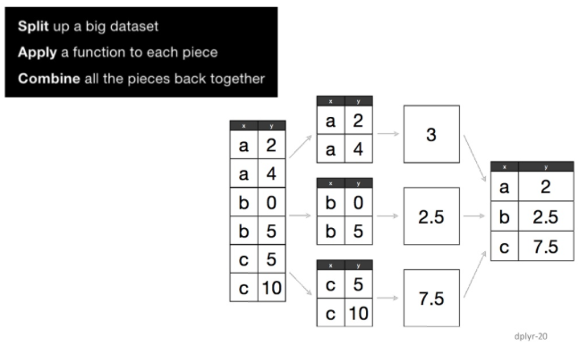
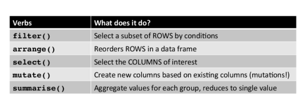

## Contents

1. R 소개  
2. 기초 함수 및 변수 다루기  
3. 데이터 핸들링  

--- .class #id

## R

* R 언어는 통계 <U>계산</U>과 <U>그래픽</U>을 위한 프로그래밍 언어  
* S-PLUS -> R (1997, GNU PROJECT)  

* 한계 : R’s biggest challenge is that most R users are not programmers  
* 극복 : Solving the “Two-Language” Problem  

### 설치 
 
* Install [R](http://www.r-project.org/)  
* Install the lastest version of [RStudio](http://rstudio.org/download/)  

---

## 적절한 code editor 고르기
예) R Studio


---

## Introduction
    
- The "Comprehensive R Archive Network" (CRAN)  
is a collection of sites which carry identical material, consisting of the R distribution(s), the contributed extensions, documentation for R, and binaries.

### 장점  
- Freeware
- 대화식 프로그램
- 방대한 라이브러리
- 다양한 OS 지원 / Java, C, Fortran 프로그래밍 인터페이스
- 다양한 그래픽 지원

### 단점
- Freeware --> 저자 마음대로 input 설정
- 국내자료가 부족

---

## R Demo

[R demo](http://soeque1.github.io/r_slide/R.pdf)

---

## 기초연산 & 변수 다루기

func | |func| |
---------|----------|---------|----------
+ - * / ^    |  단순계산 |  |
sqrt(x)    | 제곱근 | ceiling(x) | 올림
floor(x) | 내림 | abs(x) | 절댓값
trunc(x) | 버림 | log(x) | 자연로그
round(x) | 반올림 | round(x,n) | 소수점 n 까지 반올림
factorial(n) | n! | choose(n,k) | nCk
예)
```{r, results='asis'}
factorial(3)
round(25.233,1)
```

---

## 패키지(라이브러리)
```{r, pac}
head(installed.packages())
```

---
### 패키지 설치
```{r, i_pac, eval=T}
install.packages("dplyr")
```

```{r, ii_pac, eval=F}
install.packages("dplyr", repos="http://cran.rstudio.com/")
```

### 패키지 정보  

[CRAN](https://www.google.co.kr/webhp?sourceid=chrome-instant&ion=1&espv=2&ie=UTF-8#q=cran)  

[CRAN Pac. by names](http://cran.r-project.org/web/packages/available_packages_by_name.html)  
  
[CRAN Pac. by Tasks](http://cran.r-project.org/web/views/)  

---


## Help, RSiteSearch

RSiteSearch("sna")  
??sna  

---

## Data Handling

- 논리
```{r, results='asis'}
c(T,F,T)
```

- 숫자
```{r, results='asis'}
is.numeric(3);is.integer(3)
```

- 문자
```{r, results='asis'}
is.character("Kim");  is.character(c("Kim",3,5));  is.numeric(c("Kim",3,5))
```

---

## Data Handling
$$latex
\sqrt{2} \times \sqrt{2} \ne 2
$$

```{r, results='asis'}
sqrt(2) * sqrt(2) == 2
```

```{r, results='asis'}
3.55555666662314214
3.55555666662314214 == 3.556; 3.55555666662314214 == 3.55555666662314214
```

---

## Data Handling

```{r, results='asis'}
options(digits=5);3.55555666662314214
options(digits=10);3.55555666662314214
```

- 구조
 * Matrix
 * Data.Frame
 * Data.Table
 * List

---


## Matrix
```{r, cache=T}
x = matrix(NA, nrow=10, ncol=3)
x
```

---
x[1,3]=3; x[2,]=c(1,5,7); x[3,]=seq(1,3); x[4,]=1:3; x[5,]=rep(1,3)  
x[6,]=sep(5,1,by=-2);

### Missing-Handling
x[is.na(x)] = 0

```{r, echo=FALSE, cache=T}
x[1,3]=3
x[2,]=c(1,5,7)
x[3,]=seq(1,3)
x[4,]=1:3
x[5,]=rep(1,3)
x[6,]=seq(5,1,by=-2)
x[is.na(x)] = 0
```

```{r}
x
```

---

## Data.Frame

```{r}
data_ex = data.frame(height=c(168,182,175),weight=c(50,60,70),sex=c("여","남","남"))
data_ex
data_ex$married = c(T,F,T)
data_ex[,"bmi"] = data_ex[,"height"]/data_ex[,"weight"]
data_ex
```

---
### 사용(X)
```{r}
attach (data_ex);height
detach(data_ex);height
```

### 사용(O)
```{r}
with(data_ex, height);subset(data_ex, height>180)
```

---

### 사용 추천
library("dplyr")
```{r, include=F, cache=F}
library("dplyr") # by Hadley Wickham, plyr의 C++
```

```{r}
data_ex%>%filter(height>180)
```

### Big - Data

e.x) 미국 휴스턴에서 출발하는 모든 비행기의 2011년 이착륙기록  

library("hflights")  
```{r, cache=F}
library("hflights")
dim(hflights)  
```

---

```{r, cache=T}
library("hflights")
#hflights
#head(hflights)
hflights[1:3,1:5]
hflights_df = tbl_df(hflights)
hflights_df
```

---
### Mean Func
```{r, eval=F}
mean(hflights[,"DepTime"]);mean(hflights[,"DepTime"],na.rm=T)
```
---
### R Base VS dplyr
```{r}
hflights_df_rep<-rbind(hflights_df,hflights_df,hflights_df)
system.time(mean(as.data.frame(hflights_df_rep)[,"DepTime"],na.rm=T))
system.time(hflights_df_rep%>%select(DepTime)%>%dplyr::summarise(mean(DepTime,na.rm=T)))
```

---

### rbind vs rbindlist

```{r}
system.time(rbind(hflights_df,hflights_df,hflights_df))
library("data.table")
system.time(rbindlist(list(hflights_df,hflights_df,hflights_df)))
```

---

## Dplyr



[source](http://www.slideshare.net/Ram-N/data-manipulation-using-r-acm2014)

---


  

[source](http://www.slideshare.net/Ram-N/data-manipulation-using-r-acm2014)

---

### filter: Keep rows Matching Criteria

```{r}
suppressMessages(library(dplyr))
library(hflights)
flights <- tbl_df(hflights)
flights %>% filter(Month==1, DayofMonth==1)
```

---

### select: Pick columns by name

```{r, eval=F}
flights %>% select(DepTime, ArrTime, FlightNum)
```

### arrange: Reorder Rows

```{r}
flights %>% 
    select(UniqueCarrier, DepDelay) %>%
        arrange(DepDelay) # arrange(desc(DepDelay))
```

---

### mutate: Add New Variables
```{r}
flights %>%
    group_by(Dest) %>%
    summarise(avg_delay = mean(ArrDelay, na.rm=TRUE))%>%slice(1:2)
```

---
    
```{r}
a = flights %>%
    group_by(UniqueCarrier) %>%
    summarise(mean_Cancelled = mean(Cancelled),mean_Diverted = mean(Diverted))
a%>%slice(1:3)
```

```{r}
b = flights %>%
    group_by(UniqueCarrier) %>%
    summarise_each(funs(mean), Cancelled, Diverted)
colnames(a) = colnames(b)
all.equal(a,b)
```

---

### 
```{r, eval=F}
planes<- group_by(flights, TailNum)
delay<-summarise(planes, count=n(),  m_dist = mean(Distance,na.rm=T), 
     m_delay = mean(ArrDelay,na.rm=T))%>%filter(m_dist > 0, m_delay > 0, count < 800)


library(ggplot2)
ggplot(delay, aes(m_dist, m_delay)) + geom_point(aes(size = count)) + geom_smooth() 

plot(delay[,"m_dist"][[1]],delay[,"m_delay"][[1]],xlab="m_delay",ylab="m_delay",cex=delay[,"count"][[1]]/300)
lines(smooth.spline(delay[,"m_dist"][[1]],delay[,"m_delay"][[1]]),col="red")
```

---

## 데이터 불러오기

- read.csv # base
- fread # data.table

### 여러개 데이터
```{r, eval=F}
fread_multi <- function(allFiles){
    mc <- detectCores(); 
    cl <- makeCluster(mc);
    DT <- parLapply(cl,allFiles,fun=fread,
                    header=T,
                    stringsAsFactors=F,
                    colClasses=c("character","numeric","character",rep("numeric",48))) 
    #call fread on each core (well... using each core at least)
    stopCluster(cl);
    DT <- rbindlist(DT);
    return(DT);
}
```

---

### write.csv / read.csv
```{r, eval=F}
path_dir = "/Users/kimhyungjun/Dropbox/R_lecture/mydeck/r_slide/"
write.csv(delay, file=paste(path_dir,"delay.csv",sep=""),fileEncoding="CP949",
          row.names=FALSE)
header, stringAsFactors, colClasses, fileEncoding, row.names
```

```{r, eval=F}
delay_rep = read.csv(file=paste(path_dir,"delay.csv",sep=""),fileEncoding="CP949")
all.equal(as.data.frame(delay), delay_rep)

delay_rep = read.csv(file=paste(path_dir,"delay.csv",sep=""),fileEncoding="CP949",
                     stringsAsFactors = F)
all.equal(as.data.frame(delay), delay_rep)
```

---

### 여러개 데이터
$$ parallel > lapply \simeq foreach$$ 
- lapply
- paraellel
- foreach

[source](http://stackoverflow.com/questions/14650662/loading-files-in-parallel-not-working-with-foreach-data-table)

