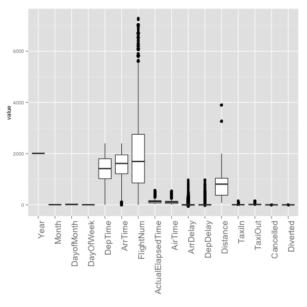
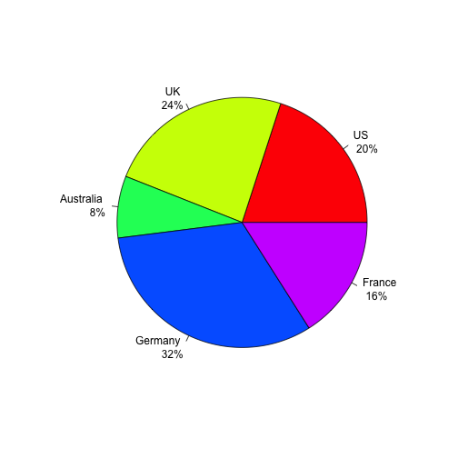

## Contents

3. 데이터 핸들링
4. 함수
5. 기술 통계
6. Visualization

--- .class #id


### 주의 사항

```r
a = 1:2; b = 3:5; c = 2:5
cbind(a,b)
```

```
## Warning: number of rows of result is not a multiple of vector length (arg
## 1)
```

```
##      a b
## [1,] 1 3
## [2,] 2 4
## [3,] 1 5
```

```r
rbind(a,c)
```

```
##   [,1] [,2] [,3] [,4]
## a    1    2    1    2
## c    2    3    4    5
```

---

## 함수
- IF 문

```r
if (.Platform$OS.type == "unix") { 
    path_dir = "A"
} else {
    path_dir = "B"
    windowsFonts(NanumGothic=windowsFont("NanumGothic"))
} 
```

- library('foo') stops when foo was not installed
- require() is basically try(library())
보통 library 를 처음에 위치, require -> 저 아래에서 실행할 때 오류


```r
if (!require("dplyr")) {
  install.packages("dplyr")
}
```

---

- FOR 문

```r
for (i in 1:3)
{
print(i)
    for (j in 1:3)
        print(j)
}
```

---

- Function
$$\sqrt{(a^2+b^2)}$$


```r
norm_op = function(a,b)
{
    norm = a^2 + b^2
    return(sqrt(norm))
}
    
norm_op(1,3)  == sqrt(10)
```

```
## [1] TRUE
```

---


```r
library("hflights")
dim(hflights); nrow(hflights); ncol(hflights)
```

```
## [1] 227496     21
```

```
## [1] 227496
```

```
## [1] 21
```

```r
colnames(hflights); #range(rownames(hflights))
```

```
##  [1] "Year"              "Month"             "DayofMonth"       
##  [4] "DayOfWeek"         "DepTime"           "ArrTime"          
##  [7] "UniqueCarrier"     "FlightNum"         "TailNum"          
## [10] "ActualElapsedTime" "AirTime"           "ArrDelay"         
## [13] "DepDelay"          "Origin"            "Dest"             
## [16] "Distance"          "TaxiIn"            "TaxiOut"          
## [19] "Cancelled"         "CancellationCode"  "Diverted"
```

---

## 기술 통계

    자료의 특성을 표, 그림, 통계량 등을 사용하여 쉽게 파악할 수 있도록 정리요약

- 평균 (mean) / 중앙값 (median) / 합계 (sum)
- 분산 (variance) / 표준편차 (sd)
- 범위 (range)
- 상관 (cor)

---


```r
mean(hflights[,"DepTime"]) # 평균-> NA
```

```
## [1] NA
```

```r
mean(hflights[,"DepTime"],na.rm=T) # 평균(missing 제거)
```

```
## [1] 1396
```


```r
sapply(hflights,is.numeric) ## Numeric or not
sapply(hflights[,sapply(hflights,is.numeric)],mean)
sapply(hflights[,sapply(hflights,is.numeric)],function(x) mean(x, na.rm=T))
```


---


```r
boxplot(hflights[,sapply(hflights,is.numeric)])
```

 


---


```r
col_sel = colnames(hflights)[sapply(hflights,is.numeric)]
boxplot(hflights[,col_sel], xaxt="n")
text(x =  1:length(col_sel), y = par("usr")[3] - 1, srt = 90, adj = 1,
     labels = col_sel, xpd=T)
```

 

---


```r
library("reshape")
hflights_df = hflights[,sapply(hflights,is.numeric)]
hflights_df[,"id"] = 1:nrow(hflights_df)
#head(hflights_df)
hflights_df_m = melt(hflights_df,id="id")
library(ggplot2)
ggplot(hflights_df_m) +
geom_boxplot(aes(x=variable, y=value))+ 
xlab("")+
theme(text=element_text(size=10),
axis.text.x = element_text(angle = 90, size = 14, hjust=1))
print(paste("# of Missing is", sum(is.na(hflights_df))))
```

---


```
## Warning: Removed 25755 rows containing non-finite values (stat_boxplot).
```

 

```
## [1] "# of Missing is 25755"
```

---

### summary


```r
summary(iris)
```

```
##   Sepal.Length   Sepal.Width    Petal.Length   Petal.Width 
##  Min.   :4.30   Min.   :2.00   Min.   :1.00   Min.   :0.1  
##  1st Qu.:5.10   1st Qu.:2.80   1st Qu.:1.60   1st Qu.:0.3  
##  Median :5.80   Median :3.00   Median :4.35   Median :1.3  
##  Mean   :5.84   Mean   :3.06   Mean   :3.76   Mean   :1.2  
##  3rd Qu.:6.40   3rd Qu.:3.30   3rd Qu.:5.10   3rd Qu.:1.8  
##  Max.   :7.90   Max.   :4.40   Max.   :6.90   Max.   :2.5  
##        Species  
##  setosa    :50  
##  versicolor:50  
##  virginica :50  
##                 
##                 
## 
```

---

## Visualization
### boxplot


```r
boxplot(iris)
```

 

---

### histogram


```r
colnames(iris)
par(mfrow=c(2,2))
hist(iris[,"Sepal.Length"])
hist(iris[,"Sepal.Length"],prob=T)
hist(iris[,"Sepal.Length"],prob=T)
lines(density(iris[,"Sepal.Length"]))
hist(iris[,"Sepal.Length"], breaks=30)
```

---

 

---


```r
plot(iris[,"Sepal.Length"])
```

 

---


```r
par(mfrow=c(1,1))
slices <- c(10, 12, 4, 16, 8) 
groups <- c("US", "UK", "Australia", "Germany", "France")
pct <- paste(round(slices/sum(slices)*100),"%",sep="")
lbls <- paste(groups, "\n",pct) # add percents to labels 
pie(slices,labels = lbls, col=rainbow(length(lbls)))
```

 

---


```r
df_ex = data.frame(slices, groups, lbls, pct)
df_ex$fraction = df_ex$slices / sum(df_ex$slices)
df_ex$ymax = cumsum(df_ex$fraction)
df_ex$ymin = c(0, head(df_ex$ymax, n = -1))
```

---

 

---


```r
# Pie / Donut plot
Pie = ggplot(data = df_ex, aes(fill = lbls, ymax = ymax, ymin = ymin, xmax = 4, xmin = 3)) +
    geom_rect(colour = "grey30", show_guide = FALSE) +
    coord_polar(theta = "y") +
 #   xlim(c(0, 4)) +
    theme_bw() +
    theme(panel.grid=element_blank()) +
    theme(axis.text=element_blank()) +
    theme(axis.ticks=element_blank()) +
    geom_text(aes(x = 3.5, y = ((ymin+ymax)/2), label = lbls)) +
    xlab("") +
    ylab("")+
     scale_fill_manual(values=rainbow(length(lbls)))
print(Pie)
```

---

 

