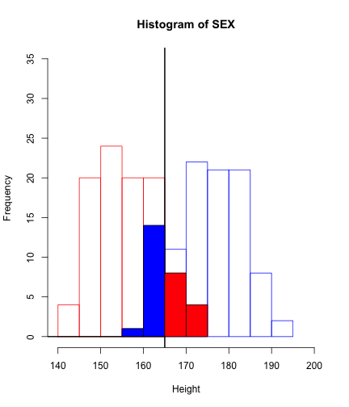

## Contents

3. 데이터 핸들링
4. 기술 통계
5. Graph & Visualization

--- .class #id

### 주의 사항

```r
a = 1:2; b = 3:5; c = 2:5
cbind(a,b)
```

```
## Warning: number of rows of result is not a multiple of vector length (arg
## 1)
```

```
##      a b
## [1,] 1 3
## [2,] 2 4
## [3,] 1 5
```

```r
rbind(a,c)
```

```
##   [,1] [,2] [,3] [,4]
## a    1    2    1    2
## c    2    3    4    5
```

---


```r
library("hflights")
dim(hflights); nrow(hflights); ncol(hflights)
```

```
## [1] 227496     21
```

```
## [1] 227496
```

```
## [1] 21
```

```r
colnames(hflights); #range(rownames(hflights))
```

```
##  [1] "Year"              "Month"             "DayofMonth"       
##  [4] "DayOfWeek"         "DepTime"           "ArrTime"          
##  [7] "UniqueCarrier"     "FlightNum"         "TailNum"          
## [10] "ActualElapsedTime" "AirTime"           "ArrDelay"         
## [13] "DepDelay"          "Origin"            "Dest"             
## [16] "Distance"          "TaxiIn"            "TaxiOut"          
## [19] "Cancelled"         "CancellationCode"  "Diverted"
```

---

## 기술 통계

    자료의 특성을 표, 그림, 통계량 등을 사용하여 쉽게 파악할 수 있도록 정리요약

- 평균 (mean) / 중앙값 (median) / 합계 (sum)
- 분산 (variance) / 표준편차 (sd)
- 범위 (range)
- 상관 (cor)

---


```r
mean(hflights[,"DepTime"]) # 평균-> NA
```

```
## [1] NA
```

```r
mean(hflights[,"DepTime"],na.rm=T) # 평균(missing 제거)
```

```
## [1] 1396
```


```r
sapply(hflights,is.numeric) ## Numeric or not
sapply(hflights[,sapply(hflights,is.numeric)],mean)
sapply(hflights[,sapply(hflights,is.numeric)],function(x) mean(x, na.rm=T))
```


---


```r
boxplot(hflights[,sapply(hflights,is.numeric)])
```

 


---


```r
col_sel = colnames(hflights)[sapply(hflights,is.numeric)]
boxplot(hflights[,col_sel], xaxt="n")
text(x =  1:length(col_sel), y = par("usr")[3] - 1, srt = 90, adj = 1,
     labels = col_sel, xpd=T)
```

 

---


```r
library("reshape")
hflights_df = hflights[,sapply(hflights,is.numeric)]
hflights_df[,"id"] = 1:nrow(hflights_df)
#head(hflights_df)
hflights_df_m = melt(hflights_df,id="id")
library(ggplot2)
ggplot(hflights_df_m) +
geom_boxplot(aes(x=variable, y=value))+ 
xlab("")+
theme(text=element_text(size=10),
axis.text.x = element_text(angle = 90, size = 14, hjust=1))
print(paste("# of Missing is", sum(is.na(hflights_df))))
```

---


```
## Warning: Removed 25755 rows containing non-finite values (stat_boxplot).
```

 

```
## [1] "# of Missing is 25755"
```
